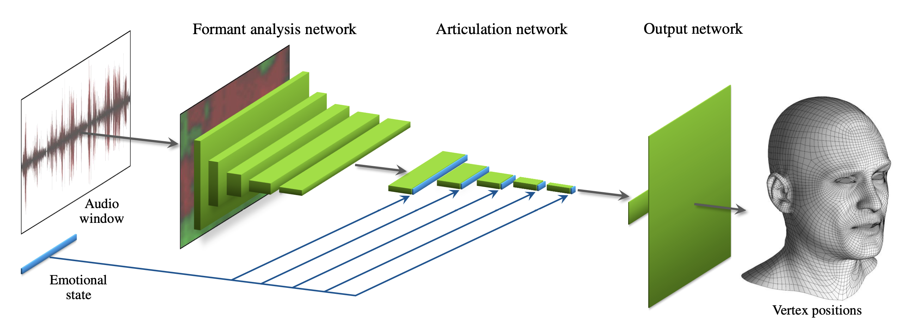
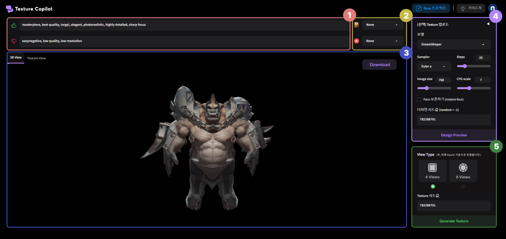

# NCSOFT에서의 3년간

## 들어가며

저는 2021년 2월부터 2024년 6월까지 NCSOFT Graphics AI Lab. 에서 3년간 Machine Learning Researcher 로 근무하였습니다. 정규직으로 첫 회사였던만큼 많은 것을 배우고 성장할 수 있었던 시간이었습니다. 이번에 NCSOFT를 떠나 새로운 시작을 하게 되면서, 어떤 것들을 배우고 경험했는지 정리해보았습니다.

저는 컴퓨터 비전 연구실에서 Object Detection과 Tracking 관련 연구를 수행하며, Machine Learning을 활용해 데이터 기반으로 실제 문제를 해결하는 것에 관심이 많았습니다. 석사 졸업 후 전문연구요원으로 편입할 회사를 찾던 중, NCSOFT에 지원하게 되었습니다. 처음에는 Vision Lab. 으로 지원을 했으나 전문연 TO 관련 문제로 옆의 GameAI Lab.에 지원하게 되었고 이후 Graphics AI Lab.으로 조직명이 바뀌었습니다. Graphics 분야는 이전에 연구하던 컴퓨터 비전 도메인과는 거리가 있어 처음에는 연구를 잘 해낼 수 있을지 걱정이 되었지만, 외부에서 활용하기 어려운 독특한 데이터를 수집하고 처리하며 연구를 진행하는 과정에서 피드백을 받아 빠르게 수정해 나가는 방식으로, “기술로 실제 문제를 해결”하는 방향으로 기여할 수 있다고 생각했습니다.

## GameAI Lab, Motion AI 팀 그리고 Facial Motion Generation (2021-2022)

<iframe width="560" height="315" src="https://www.youtube.com/embed/ahEZAJ-bxoI" title="YouTube video player" frameborder="0" allow="accelerometer; autoplay; clipboard-write; encrypted-media; gyroscope; picture-in-picture" allowfullscreen></iframe>

### 코로나의 해

2021년은 COVID-19의 해였습니다.

거대하고 강력한 바이러스가 세계를 휩쓸며 모두의 삶을 크게 변화시켰고 근무 환경도 이전과는 달라졌습니다. 제가 처음 출근했을 때는 비대면 재택 근무가 활성화되어 있어서, 거의 비어있는 사무실에서 안내를 도와줄 버디 한 명과 함께 했습니다. 새로운 모험을 텅 비어 적막한 사무실에서 시작하는 광경은 무서웠지만, 새로운 기회라고 생각했습니다.

저는 재택 근무가 생산성을 악화시키지 않으며, 오히려 효율적인 근무에 도움이 된다고 믿고, 시간과 공간에 구애받지 않고 새로운 실험과 연구를 자유롭게 할 수 있다는 점은 재택 근무의 큰 장점이라고 생각했습니다. 하지만 업무 전반에 대한 이해와 동료와의 유대 관계가 형성되기 전에 재택 근무를 시작하는 것은 생각보다 더 적응하기 어려운 일이었습니다. 새로운 것들을 배워나가는 입장에서 비대면 근무는 다소 지치고 힘든 일이었습니다. 때로는 지루하고 진전이 없는 회의의 연속에 지치기도 하고, 업무에 필요한 기반 지식들이 부족했지만 쉽게 물어보기 어려워 한참을 헤메기도 했습니다.

그러나, 재택 근무 덕분에 출퇴근 시간에 허비되는 시간과 스트레스를 줄일 수 있었고, 그 시간을 자기계발이나 여가 시간으로 활용할 수 있었습니다. 또한, 자신의 작업 환경을 자유롭게 구성할 수 있어 업무 집중도가 높아졌습니다. 특히, 제 경우에는 머신러닝 모델 연구가 주 업무였기 때문에 다른 사람과의 협업이 비교적 적었습니다. 이러한 환경에서 재택 근무는 배포나 마감 등 일정에서 비교적 자유로워 시간을 스스로 배분할 수 있었고, 집중이 잘 되는 시간에 업무를 선택하여 할 수 있었기 때문에 매우 유리했습니다. 비록 처음에는 낯설고 힘들었지만, 재택 근무를 통해 더욱 창의적이고 효율적인 업무 방식을 찾을 수 있었던 소중한 시간이었다고 생각합니다.

### Motion AI

**MotionAI** 팀은 *사람의 움직임을 그대로 디지털에서 재현*하는 것을 목표로 하는 조직입니다. 여기에는 데이터를 수집하는 과정부터 모델을 설계하고 학습시키며 실제 서비스에 적용하는 과정까지 다양한 세부 조직과 목표들이 있었습니다.

특히, MotionAI Lab에서는 고품질 데이터를 위한 모션 캡쳐와 페이셜 캡쳐를 자체적으로 진행하고 있었으며, 이렇게 수집된 데이터를 제대로 활용하기 위해 많은 전처리 과정을 통해 데이터를 정제하고 누적하는 데 심혈을 기울이고 있었습니다. 기존에 연구하던 이미지나 텍스트와 달리 모션(애니메이션) 데이터는 매우 부족했고, 모션에 대한 평가 방법을 설계하는 것도 매우 까다로워 많은 고민이 필요했습니다. 또한 이미지나 텍스트와 달리 모션은 시간적인 흐름이 중요하기 때문에 모델 설계에서도 이를 고려하여 많은 시행 착오와 함께 새로운 평가 방법을 설계하고 적용하였습니다.

연구실과 크게 달랐던 점은 데이터 수집과 전처리 부분과 실제 서비스를 위해 연구를 고도화 하고 다른 조직에 이를 소개하여 사용하게 만드는 과정이었습니다. 연구실에서는 주로 정제된 챌린지 데이터셋에서 정해진 메트릭으로 좋은 결과를 얻어내는 실험들을 진행했습니다. 산학 협력 과제 등으로 수집된 원시 데이터로부터 목적에 맞는 데이터 처리 방법을 고안하고 실제 서비스를 고려하여 실험해 본 경험이 있었습니다. 이 때 비교적 잘 알려진 비전 도메인은 참고할 수 있는 자료가 많았지만 그래픽스는 메트릭으로 정량화하기도 어려워 챌린지나 데이터셋을 참고하기 힘들었고, 새로운 도메인이었기 때문에 참고할만한 자료를 빠르게 찾는 것이 어려웠습니다. 특히 그래픽스와 애니메이션과 같은 시각적으로 표현되는 데이터에 대해 메트릭을 정의하고 이를 통해 모델을 평가하는 것은 매우 어려운 일이었습니다.

또한 회사에서는 이러한 연구를 통해 기술을 개발하면서 다른 조직에 기술을 소개하고 사용하도록 만들어야 했습니다. 대부분 다른 조직들이 바로 사용해 볼 수 있도록 데모를 제공해야 했고, 계속 추가되는 요구사항과 피드백을 반영하여 연구를 진행하고 기술을 개발하는 것이 중요했습니다.

제가 연구했던 부분은 [Facial Animation Generation Model](https://ncsoft.github.io/ncresearch/f14fbccc9aa3543db2f83b5b79cf2238ba240227)이었습니다. 이 연구에는 다음과 같은 여러 가지 도전적인 목표들이 있었습니다. *다양한 음성 입력이 주어졌을 때 일관된 얼굴 애니메이션을 생성*할 수 있어야 하고, *다양한 스타일로 변경*이 가능하며, *발음의 타이밍이 정확*해야 하며, *높은 퀄리티의 애니메이션을 생성*할 수 있어야 했습니다. 또한 애니메이터가 *쉽게 편집할 수 있도록 리그로 생성*할 수 있어야 했습니다.

이를 위해 다양한 모델을 실험하고, 고품질 페이셜 캡처를 활용해 데이터를 수집하고 전처리하는 과정을 거쳤으며, 성능을 향상시키기 위한 노력을 기울였습니다. 모델의 성능을 높이기 위한 다양한 방법들을 시도해보는 과정에서 얻은 중요한 교훈 중 하나는, 기술적인 성능만큼이나 사용자 경험도 중요하다는 것이었습니다. 특히 모션의 경우 정량적 지표로 표현하기 어려운 만큼, 애니메이터와의 협업을 통해 얻은 피드백을 반영하여 모델을 개선하는 과정은 매우 중요했습니다. 일례로 게임에서 활용되는 애니메이션 표현들은 실제 캡처된 데이터보다 과장되어야 하기 때문에 아티스트의 의견을 수용해 의도적으로 캡처된 원시 GT를 과장되게 표현하도록 하는 경우도 있었습니다. 이렇게 수집된 피드백은 모델의 세부 조정을 가능하게 했으며, 최종 결과물의 품질을 높이는 데 큰 도움이 되었습니다. 

또한, 게임 제작 파이프라인에 활용하기 위해 고려해야 할 사항들도 있었습니다. 이런 문제들을 효과적으로 해결하기 위해 내부적으로 phoneme 정보를 활용한 모델, GAN을 활용한 모델, Audio Encoder를 활용한 모델, Transformer 기반의 모델 등 다양한 방법을 시도해보았습니다. 이러한 다양한 접근 방식 덕분에 각각의 모델이 어떤 문제와 조건에 적합한지 알 수 있었고, 이를 통해 연구를 진행하는 방법에 대해 많은 것을 배울 수 있었습니다.

_Audio-Driven Facial Animation by Joint End-to-End Learning of Pose and Emotion, NVIDIA (2018)_

## Graphics AI Lab에서의 Digital Human (2023)

<iframe width="560" height="315" src="https://www.youtube.com/embed/4mfESaPbLI4" title="YouTube video player" frameborder="0" allow="accelerometer; autoplay; clipboard-write; encrypted-media; gyroscope; picture-in-picture" allowfullscreen></iframe>

2023년 NCSOFT의 Research 조직은 실시간으로 상호작용하며 인간의 창의력과 즐거움의 가치를 발전시킬 **디지털 휴먼**을 만드는 데 초점을 맞추었습니다. NCSOFT에는 Graphics AI Lab, Speech AI Lab, Vision AI Lab, NLP Center 그리고 뛰어난 아트 인력 등 디지털 휴먼에 필요한 역량이 충분히 갖추어져 있었습니다. 이를 통해 적절하게 답변을 하고, 그 과정에서 표정이나 몸짓 등 비언어적인 상호작용까지 표현할 수 있는 고품질 디지털 휴먼을 더 쉽고 빠르게 대량생산하도록 파이프라인을 형성하는 데까지 나아가고자 했고, 궁극적으로는 디지털 휴먼이 모든 분야에서 활약하는 IP로서 일반 사용자도 대중적으로 활용할 만큼 효율적인 기술로 자리 잡도록 하려고 했습니다. 이를 위해 시간과 비용이 많이 드는 복잡한 과정을 여러 AI 기술로 자동화, 효율화하는 데 초점을 맞추고, 특히 ‘실시간 인터랙션’이 가능한 고품질 디지털 휴먼을 만들기 위한 AI 기반의 그래픽스 파이프라인을 만들려고 했습니다.

Graphics AI Lab에서는 이러한 목표를 달성하기 위해 다양한 AI 기술을 연구하고 개발하고 있었습니다. Graphics AI Lab에서 [NFace](https://nc-moai.github.io/news/Lip_Sync/) 라고 이름붙여진 대사나 목소리를 넣으면 상황에 맞는 얼굴 표정과 입술의 움직임을 자동으로 생성하는 Voice-to-Face 기술을 개발했었고 이를 찡그림이나 웃음 등 사소한 비 언어적 표현까지 생성할 수 있는 모델로 고도화하였습니다.

디지털 휴먼은 여러 AI조직이 각각 연구 개발하던 여러 기술을 하나로 통합하는 과정이었습니다. Vision AI Lab에서 만든 여러 인지 기술로 디지털 휴먼이 자연스럽게 사용자의 외형을 보고 말을 걸 수 있도록 하고, NLP Center의 기술들을 활용해 대화의 맥락을 이해하고 답변을 생성하며, Speech AI Lab의 기술을 활용해 감정이 담긴 자연스러운 TTS를 생성하며 Graphics AI Lab에서 만든 여러 생성형 기술로 모션과 얼굴 등을 생성해 보여주는 과정 등을 거치게 됩니다.

처음부터 통합을 염두해두고 개발되지 않았던 연구 개발 결과물을 하나의 파이프라인으로 통합하는 과정은 매우 복잡하고 어려운 일이었습니다. 이전까지 각 조직은 각각의 목표와 의도를 가지고 기술을 개발해 오고 있었기 때문에 하나의 명세나 요구사항 아래에 통합하기 위해 많은 노력이 필요했습니다. 여러 모델들이 서로 다른 입출력을 가지고 있었기 때문에 성능을 유지하면서 지연을 최소로 하는 효율적인 구조 설계를 위해 개선하는 과정도 필요했습니다.

저는 Graphics AI Lab에서 기존에 연구 개발했던 NFace가 실제 Inference에서 비효율적인 부분이 많아 느리게 동작함을 파악하고 이를 개선하고 서빙하기 위한 API 서버 등을 설계, 구현했습니다. Knowledge distillation, Quantization, Pruning 등을 통해 모델의 크기를 줄이고 속도를 향상시키는 방법을 적용했고, shared network로 feature extractor 등을 개선했습니다. 이를 torch compiled script, ONNX, TensorRT 등으로 변환하여 서빙 속도를 극대화하는 방법 등도 시도했었습니다.

하지만 이러한 디지털 휴먼 개발 과정은 어려운 점들도 많았습니다. 제가 느낀 가장 큰 문제점은 이전까지 다른 조직 간의 협업이 잘 이루어지지 않아서 커뮤니케이션 비용이 크게 발생하고 일정 관리와 전반적인 관리가 미비했다는 점이었습니다. 특히 각 조직을 통합해서 관리할 수 있는 사람이 없고 요구사항이 명확하지 않아 스펙이 계속 변경되었기 때문에 업무가 더디게 진행되고 같은 일을 반복하거나 불필요한 일을 하게 되는 경우가 잦았습니다.

## Texture Copilot Project (2024)

<iframe width="560" height="315" src="https://www.youtube.com/embed/6qGsSw7CffQ" title="YouTube video player" frameborder="0" allow="accelerometer; autoplay; clipboard-write; encrypted-media; gyroscope; picture-in-picture" allowfullscreen></iframe>

[Texture Copilot Project](https://ncsoft.github.io/ncresearch/3f0ba4889e331ddbed68c9dd48d845fa18d874de)은 3D 오브젝트의 텍스쳐를 빠르게 프로토타이핑 하여 실제 아티스트의 파이프라인을 효율적으로 개선하는 목적을 가지고 2023년 하반기에 새로 입사한 인턴(J)님이 시작한 연구였습니다.

Stable Diffusion 이후 2D 이미지 생성 모델의 성능이 크게 향상되면서 게임 개발 프로세스에서 많은 부분을 차지하는 그래픽 에셋 생성에 도움을 줄 수 있을 것이라는 기대가 있었고 저희는 여기서 더 나아가 텍스트나 기존 텍스쳐로부터 빠르고 쉽게 3D 모델의 텍스쳐를 만들어 내고 의도대로 변형할 수 있다면 주로 사용되고 있는 3D 모델링 파이프라인을 크게 개선할 수 있을 것이라고 생각했습니다.

J는 원래 인턴 과제로 3D facial animation에 사용할 mesh의 texture 생성 관련 연구를 진행했으나 텍스쳐 생성의 활용성을 고도화해서 게임 제작 파이프라인에서 텍스쳐링 부분을 개선할 수 있을 것이라 판단해 프로젝트를 확장했습니다. 처음에는 [Gradio](https://www.gradio.app/)로 만들어진 데모 프로젝트로 실제 잠재 고객인 사내 아티스트분들에게 피드백을 받아서 에셋 생성 파이프라인 개선에 활용할 수 있도록 필요한 기능과 성능을 개선했고 여러 차례 테스트와 PoC 이후, 실제 서비스로 고도화시키게 되었습니다. 그렇게 구성된 TextureCopilot 팀은 4명의 작은 팀으로 3D 에셋 생성으로 파이프라인 개선이라는 목적 달성을 위해 기민하게 움직이고 있습니다.

_Texture Copilot Demo, NCSOFT_

이러한 텍스쳐 생성에서 가장 문제가 되는 부분은 다른 생성모델도 그러하듯 일관성입니다. 3D 객체의 2D Texture Map을 바로 diffusion 모델로 생성하면 각 geometry에 대응하도록 context를 넣어주기 어려워서 일관성이 떨어지게 됩니다. Multi-View에서 2D Texture Map을 생성하려면 3D 객체의 모든 View에 대응하는 Texture Map을 생성해야 하는데 이는 매우 어려운 문제입니다. 이러한 문제를 해결하기 위해 기존 연구들은 이전 단계의 생성 결과를 다른 View에서 렌더링하고, 적절히 파티셔닝 해서 주변 컨텍스트를 In-painting하면서 주입하는 방법을 제시하고 있습니다. 다만 이러한 방법을 그대로 활용하기엔 주어진 메시의 지오메트리를 정확하게 인식하지 못하고, 해상도가 낮아 품질이 떨어지는 문제가 있었습니다.

저희는 먼저 3D Mesh Geometry를 Canny, Normal, Depth 등 여러 ControlNet을 활용해 보다 정확하게 전달하고, Loss Function을 통해 Image를 UV Space상으로 Projection하는 방법을 개선해 Mesh의 UV Mapping 정보를 바탕으로 Image를 Texture에 Mapping하는 자체 Projection Method를 구현하고 Blending algorithm을 개선해 Texture의 Image 품질을 개선했습니다.

저는 이 프로젝트에서 연구를 진행하면서 실험을 진행하고 모델을 개선하는 과정과 더불어, 연구자로 구성되어 엔지니어링 역량이 부족한 Graphics Lab 내에서 프로젝트의 서비스화를 위해 프론트엔드, 백엔드 구성 그리고 Model serving을 위한 MLOps를 포함한 엔지니어링 전반을 담당했습니다. 저는 ML Research 이전에 소프트웨어 엔지니어링 전반에 관심이 있었고, 그 때문에 폭 넓은 분야에서 기여할 수 있었습니다. 완벽한 설계와 구조, 구현은 아니지만 컨셉을 확인하고 피드백을 받아 반영하고 연구하던 모델을 서빙하는데에는 충분한 구조로, 확장이 필요할 때 확장할 수 있도록 고려하면서 적정 기술을 사용하는 것을 우선으로 생각하여 서비스를 만들어 나갔습니다.

모든 과정을 자세하게 알고 있지 않았고, 거의 처음 사용해보는 프론트엔드 스택들과 처음 사용해보는 기술을 활용해보기 위해 ChatGPT의 도움을 적극적으로 활용했습니다. 서비스의 전체적인 구조를 디자인하고 이를 위해 구체적으로 어떤 기술을 어떻게 활용해 작성해야 하는지, best practice는 무엇인지 ChatGPT를 활용해 공부하고 이를 토대로 개발을 빠르게 진행할 수 있었습니다. 또한, 소프트웨어 엔지니어링에 익숙하지 않은 연구자 동료들과 일하면서 서비스 개발 과정을 혼자 전담하다보니 신경쓰지 못한 부분이 많았는데 방법론에 대해서도 ChatGPT를 활용해 팀 전체의 소프트웨어 엔지니어링 역량을 끌어올리기 위해 일감을 적절히 분배하고, 코드 리뷰를 통해 코드 품질을 높이고 기본적인 아키텍쳐와 코드 구성에 대해 논의하고 다른 모범 사례 등을 살펴보면서 우리 제품에는 어떻게 적용할 수 있을지 공부하고 공유했습니다.

프론트엔드는 [React.js](https://react.dev/)를 활용해 간단하게 구성하고 [three.js](https://threejs.org/) 및 [react-three-fiber](https://docs.pmnd.rs/react-three-fiber)를 비롯한 WebGL 기술 등을 활용하여 애셋 프리뷰를 띄우고 간단한 인터렉션을 할 수 있도록 구성했습니다. [FastAPI](https://fastapi.tiangolo.com/)로 구성된 백엔드는 비교적 매우 느린 생성을 위한 ML Process를 위해 비동기적으로 websocket으로 결과를 업데이트 할 수 있도록 구성하고 [RabbitMQ](https://www.rabbitmq.com/)와 [Celery](https://docs.celeryq.dev/)를 활용해 GPU Worker로 실제 Inference가 이루어지도록 구성했습니다. 실제 서비스 로직에서 Mutable 한 고용량 데이터와 업데이트 되어야 하는 데이터를 분리해 [MinIO](https://min.io/)에 저장하고 이를 통해 데이터를 관리하고 업데이트할 수 있도록 구성했습니다.

아쉽게도 실내 베타 테스트를 준비하는 과정에서 퇴사를 하게 되어 제품을 만들고 성장하는 과정을 더 이상 함께할 수 없지만 이 프로젝트를 통해 많은 것을 배우고 성장할 수 있었습니다. 특히 연구와 엔지니어링을 병행하면서 서비스를 개발하고 운영하는 과정은 제가 성장하는 데 많은 도움이 되었습니다. 같이 할 수 있었던 팀원들에게 언제나 감사의 인사를 드립니다.

## NCSOFT에서의 회사 생활

### 긍정적인 부분

첫 정규직 회사로 입사하게 된 NCSOFT는 생각보다 큰 회사였고 복지도 훌륭했습니다. 많은 부분에서 업무에만 집중할 수 있도록 회사가 지원해주는 부분이 많았습니다.

저는 아침에 출퇴근 시간을 피해 조금 늦게 또는 조금 이르게 출근을 한 후 지하의 피트니스 센터에서 운동을 하고, 목욕탕에서 씻고 개운한 기분으로 근무를 시작할 수 있었습니다. 이 후 탕비실에서 커피를 내려 마시고 맛있는 점심을 먹고 업무를 진행하고 저녁을 테이크아웃해서 퇴근하는 일상을 보냈습니다.

휴게 공간이 넉넉하지는 않지만 크게 모자라지는 않았고, 사옥 내에 메디컬 센터도 있어서 간단한 처치나 시술 등을 받을 수 있었습니다. 특히 코로나가 한창이던 시절 빠르게 검사할 수 있어서 매우 편리했습니다. 또한 사옥 내 어린이집이 있어 아이를 둔 사우님들은 매우 편리했고, 컨퍼런스 홀은 결혼식장으로 사용되기도 하여 사우들이 저렴한 가격에 이용할 수 있었던 점도 신기했습니다. 

회사에서는 휴양소를 비롯해 여러 가지 복지 프로그램을 추첨으로 운영하여 활용할 수 있었고, 큰 금액은 아니지만 경조사비나 상여금 등이 지급되기도 했습니다. 사내에 소모임이나 동아리 등의 활동들도 잘 구비되어 있었고, 다양한 사내 세미나나 교육 프로그램도 운영되고 있었습니다.

연구를 위한 장비나 재정적 지원도 크게 모자람은 없었습니다. 로컬 테스트에 적당한 GPU와 고성능 A100 서버, 학습 클러스터나 대용량 네트워크 스토리지 등 크게 모자람이 없는 환경이었습니다. 특히 고품질 데이터 수집을 위해 [LightCage](https://about.ncsoft.com/news/article/lightcage-20210826) 와 같은 최신 3D 스캔 장비와 연구중인 [4D Scan 파이프라인](https://ncsoft.github.io/ncresearch/61fda2c4f6b3c54a863755104a7948d2e4cb9fd8)을 활용한 데이터나 게임 제작에 활용되는 에셋들을 활용해 볼 수 있었습니다.

### 아쉬웠던 부분

다른 IT 기업과 마찬가지로 수평적인 문화를 지향하고, 열린 분위기에서 일하는 것처럼 보였지만, 방향성과 성과 측면에서는 수직적인 문화가 많이 남아있었습니다. 특히 목표 설정과 공유, 설득의 과정이 부족하다고 느꼈고, 이는 프로젝트 진행에 있어서 불필요한 혼란을 야기하고, 팀원들의 업무량이 불균형하게 분배되며 우리가 어떤 목표를 향해서 나아가야 하는지, 어떤 중간 이정표를 달성하면 되는지, 어떤 결과를 만들어 내면 되는지에 대한 명확한 방향성이 부족했습니다. 또한 커뮤니케이션들이 투명하게 공유되지 않아 팀원과 리더들의 방향이 다른 경우가 많았습니다. 전사적으로도 업무 목표 설정과 공유, 성과 측정 부분에서 아쉬움이 있었고 방향성에 납득하기 어려운 부분이 많았습니다.

또한 연구 조직으로서의 정체성도 많이 흐려지고 있었습니다. 실제 서비스에 적용되고 실무에 도움이 되는 연구를 진행하는 것은 좋은 방향이었지만 단기적으로 목표가 자주 바뀌고, 어떤 결과를 만들어 내야 하는지, 어떤 조직과 어떤 프로세스에 도움이 되어야 하는지에 대한 명확한 방향성이 부족해서 아쉬웠으며 회사 사정에 따라 연구조직으로 엔지니어링 역량이 부족할 수밖에 없는 조직에서 연구 결과 적용을 위한 서비스 개발까지 전담하게 되어서 연구자로서의 역량을 더욱 키울 수 있는 기회가 부족해졌다고 생각했습니다. 그렇다고 서비스 개발 및 엔지니어링 경험이 긍정적이지도 않아서 더욱 힘들었습니다.

불확실하고 불투명한 목표, 불명확한 역할 분담으로 성과가 제대로 측정되지 않고, 무엇을 위해서 이러한 일들을 진행하는지 동기 부여가 제대로 되지 않아 하나의 팀이 되어 목표를 향해 달려간다는 느낌을 받을 수 없었습니다.

## 맺음말

NCSOFT에서 근무하면서 저는 제가 원하는 근무 환경이 무엇인지 다시 한번 생각해 보게 되었습니다. 

사에서 일을 한다는게 언제나 즐거울 순 없지만 스스로 즐겁다고 느낄 수 있어야 일도 더 잘할 수 있다고 생각합니다. 그래서 어떤 환경에서 스스로 즐겁다고 느끼고 있었는지 돌이켜보고 어떤 부분이 즐겁지 않게 느껴졌는지 돌아보았습니다. 저는 크게 아래와 같은 근무 환경에서 일하는 것을 즐겁게 생각합니다.

1. 기술(ML)을 통해 가치를 전달할 수 있는 서비스 개발 또는 그러한 기술 개발에 기여
2. 함께 성장할 수 있는 동료
3. 명확한 목표와 방향성을 제시하거나, 동기 부여가 가능한 리더십
4. 업무에 방해되지 않는 근무 환경과 생산성을 보조하는 복지

NCSOFT에서의 연구와 엔지니어링을 병행하면서 서비스를 개발하고 운영하는 과정은 많은 것을 배울 수 있었고 분명 다른 곳에서 해보기 어려운 경험도 있었기 때문에 1번 항목은 적절히 만족했습니다. 또한 회사 생활 전반과 연구를 위한 장비 및 재정적 지원, 복지 수준이 매우 훌륭했고 근무시간을 선택적으로 운용할 수 있었기 때문에 4번 항목도 만족했습니다.

하지만 반복되는 명확하지 않은 목표 설정과 불확실한 방향성, 동기부여할 수 있는 리더십 미비 등이 있었고 이를 해결하기 위해 커뮤니케이션을 시도해도 수직적인 조직 체계 하에서 바뀌기 어렵다는 사실을 깨닫게 되었고, 이러한 부분이 2, 3번 항목에 영향을 미쳤습니다. 이러한 부분이 현재 NCSOFT가 겪고 있는 고난에 영향이 없지는 않다고 생각합니다. 특히, 경영 실패의 책임을 직원에게 전가하여 권고사직을 단행하고 사우들의 반대에도 불구하고 분사를 강행하는 회사의 기조가 여러 문제를 단편적으로 보여주고 있어서 더 좋은 환경을 찾아 도전해보고 싶다는 생각이 들었습니다.

2024년 6월 퇴사를 하여 새로운 도전을 하게 되었고, [Return Zero](https://www.rtzr.ai/)에서 Research Engineer로 다음 도전을 시작하기로 했습니다.
