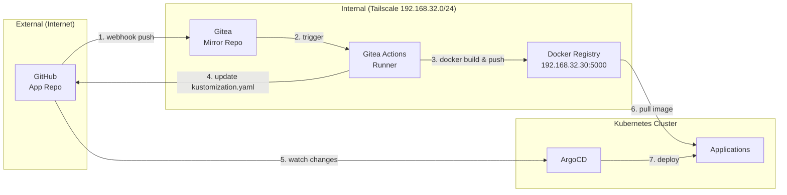

# Home Lab CI/CD: Private Registry + Gitea Actions

> 목표: **코드 푸시 → 이미지 빌드 → 자동 배포**까지 한 번에.
> 결과: GitHub에 푸시하면 내부 Registry에 이미지가 올라가고, ArgoCD가 K8s에 배포.

---

## 배경: 왜 Private Registry가 필요했나

[Home Lab IaC 글](/home-lab-iac)에서 GitOps 구조를 설명했다. 코드를 푸시하면 Gitea Actions가 이미지를 빌드하고, ArgoCD가 K8s에 배포한다. 이 흐름에서 빠진 게 하나 있다: **이미지를 어디에 저장하지?**

Docker Hub를 쓸 수도 있지만:

- **비공개 이미지**: 개인 프로젝트는 공개하고 싶지 않음
- **Pull 제한**: 무료 플랜은 시간당 pull 횟수 제한
- **네트워크 비용**: 외부로 왔다갔다 하는 트래픽

그래서 내부에 Private Registry를 운영하기로 했다. Tailscale 내부에서만 접근 가능하니 보안도 간단하다.

---

## 전체 CI/CD 아키텍처



### 흐름 설명

1. GitHub에 코드 푸시
2. Webhook이 Gitea에 push 이벤트 전달
3. Gitea가 미러 동기화
4. Gitea Actions Runner가 워크플로우 실행
5. Docker 이미지 빌드 → Private Registry 푸시
6. IaC 레포의 `kustomization.yaml` 업데이트 (이미지 태그)
7. ArgoCD가 변경 감지 → K8s 배포
8. K8s가 Registry에서 이미지 pull

---

## Private Docker Registry 구축

### 왜 LXC에 직접 설치했나

Docker Registry는 컨테이너 이미지를 저장하는 단순한 서비스다. Docker로 띄울 수도 있지만, LXC 컨테이너에 바이너리를 직접 설치했다:

- **의존성 최소화**: Docker-in-LXC는 설정이 복잡함
- **리소스 절약**: Docker 데몬 오버헤드 없음
- **단순함**: systemd로 서비스 관리

### Ansible Role 구성

```yaml
# roles/docker-registry/defaults/main.yml
registry_version: "2.8.3"
registry_listen_address: "0.0.0.0"
registry_listen_port: 5000
registry_storage_path: /var/lib/docker-registry
registry_auth_enabled: false
registry_storage_delete_enabled: true
```

설치 과정:

1. GitHub releases에서 바이너리 다운로드
2. 설정 파일 생성 (`config.yml`)
3. systemd 서비스 등록
4. 시작 및 활성화

```yaml
# config.yml.j2
version: 0.1
storage:
  filesystem:
    rootdirectory: {{ registry_storage_path }}
  delete:
    enabled: {{ registry_storage_delete_enabled | lower }}

http:
  addr: {{ registry_listen_address }}:{{ registry_listen_port }}
  headers:
    X-Content-Type-Options: [nosniff]

health:
  storagedriver:
    enabled: true
    interval: 10s
    threshold: 3
```

### 접근 제어

Registry 자체에는 인증을 걸지 않았다. 대신 **네트워크 레벨에서 제한**:

- Tailscale 내부에서만 접근 가능 (Split DNS로 `registry.internal.jiun.dev` 해석)
- Gateway nginx에서 리버스 프록시 + HTTPS 종료
- 외부 노출 없음 (Cloudflare Tunnel에서 제외)

이렇게 하면 인증 관리 부담 없이 보안을 유지할 수 있다. 물론 팀 환경이라면 htpasswd나 토큰 인증이 필요하겠지만, 개인 홈랩에서는 과하다.

---

## Gitea 미러 구성

### 왜 GitHub → Gitea 미러인가

GitHub Actions로 직접 빌드할 수도 있지만:

- **Private Registry 접근**: GitHub에서 내부망 Registry로 푸시하려면 Tailscale을 Runner에 연결해야 함
- **비용**: GitHub Actions 무료 분수 제한
- **네트워크**: 이미지 빌드가 내부에서 이뤄지면 더 빠름

Gitea를 Self-hosted로 띄우고, GitHub 레포를 미러링하면 이 문제가 해결된다.

### 미러 설정

Gitea 웹 UI에서 설정:

1. **New Migration** → **GitHub**
2. 레포 URL 입력 (예: `https://github.com/jiunbae/app-name`)
3. **Mirror** 체크
4. **Sync interval** 설정 (기본 8시간, webhook으로 즉시 동기화 가능)

GitHub 쪽에서 Webhook 설정:

```
Payload URL: https://gitea.jiun.dev/api/v1/repos/{owner}/{repo}/mirror-sync
Content type: application/json
Secret: (Gitea에서 생성)
Events: Just the push event
```

이제 GitHub에 푸시하면 즉시 Gitea에 동기화된다.

---

## Gitea Actions 워크플로우

### Runner 설정

Gitea Actions Runner는 Gitea 서버와 별도로 실행된다. 나는 k3s 클러스터에 컨테이너로 띄웠다:

```yaml
apiVersion: apps/v1
kind: Deployment
metadata:
  name: gitea-runner
spec:
  template:
    spec:
      containers:
        - name: runner
          image: gitea/act_runner:latest
          env:
            - name: GITEA_INSTANCE_URL
              value: "https://gitea.jiun.dev"
            - name: GITEA_RUNNER_REGISTRATION_TOKEN
              valueFrom:
                secretKeyRef:
                  name: gitea-runner-token
                  key: token
```

Runner는 Docker-in-Docker로 동작해서 이미지 빌드가 가능하다.

### 워크플로우 예시

`.gitea/workflows/deploy.yml`:

```yaml
name: Build and Deploy

on:
  push:
    branches:
      - main

env:
  REGISTRY: registry.jiun.dev
  IMAGE_NAME: my-app
  IAC_REPO: jiunbae/IaC
  APP_PATH: kubernetes/apps/my-app

jobs:
  build:
    runs-on: ubuntu-latest
    steps:
      - name: Checkout
        uses: actions/checkout@v4

      - name: Set up Docker Buildx
        uses: docker/setup-buildx-action@v3

      - name: Log in to Registry
        uses: docker/login-action@v3
        with:
          registry: ${{ env.REGISTRY }}
          username: ${{ secrets.REGISTRY_USERNAME }}
          password: ${{ secrets.REGISTRY_PASSWORD }}

      - name: Build and push
        uses: docker/build-push-action@v6
        with:
          context: .
          push: true
          tags: |
            ${{ env.REGISTRY }}/${{ env.IMAGE_NAME }}:${{ github.sha }}
            ${{ env.REGISTRY }}/${{ env.IMAGE_NAME }}:latest
          cache-from: type=registry,ref=${{ env.REGISTRY }}/${{ env.IMAGE_NAME }}:buildcache
          cache-to: type=registry,ref=${{ env.REGISTRY }}/${{ env.IMAGE_NAME }}:buildcache,mode=max

      - name: Checkout IaC repo
        uses: actions/checkout@v4
        with:
          repository: ${{ env.IAC_REPO }}
          token: ${{ secrets.IAC_GITHUB_TOKEN }}
          path: iac

      - name: Update image tag
        run: |
          cd iac/${{ env.APP_PATH }}
          sed -i "s/newTag: .*/newTag: ${{ github.sha }}/" kustomization.yaml

      - name: Push to IaC repo
        run: |
          cd iac
          git config user.name "Gitea Actions"
          git config user.email "actions@gitea.jiun.dev"
          git add ${{ env.APP_PATH }}/kustomization.yaml
          git diff --staged --quiet || git commit -m "chore(${{ env.IMAGE_NAME }}): update image tag to ${{ github.sha }}"
          git push
```

### 핵심 포인트

1. **이미지 태그로 commit SHA 사용**: 어떤 코드가 배포됐는지 추적 가능
2. **빌드 캐시**: Registry에 캐시 저장해서 재빌드 시간 단축
3. **IaC 레포 업데이트**: 이미지 태그만 변경하고 커밋 → ArgoCD가 감지

---

## 이미지 캐싱 전략

### Registry 캐시

Docker Buildx의 `cache-to`와 `cache-from`으로 레이어 캐시를 Registry에 저장:

```yaml
cache-from: type=registry,ref=registry.jiun.dev/my-app:buildcache
cache-to: type=registry,ref=registry.jiun.dev/my-app:buildcache,mode=max
```

`mode=max`는 모든 레이어를 캐시해서 중간 단계 재사용이 가능하다.

### 효과

- **첫 빌드**: 약 5분 (의존성 설치 포함)
- **캐시 있을 때**: 약 30초 (변경된 레이어만 빌드)

특히 Node.js 프로젝트에서 `npm install` 레이어가 캐시되면 빌드 시간이 크게 줄어든다.

---

## 스토리지 관리

### 가비지 컬렉션

이미지를 계속 푸시하면 스토리지가 가득 찬다. Registry는 기본적으로 오래된 레이어를 자동으로 삭제하지 않는다.

가비지 컬렉션 실행:

```bash
# 드라이런
registry garbage-collect /etc/docker-registry/config.yml --dry-run

# 실제 삭제
registry garbage-collect /etc/docker-registry/config.yml
```

Cron으로 주기적 실행:

```bash
# /etc/cron.weekly/registry-gc
#!/bin/bash
/usr/local/bin/registry garbage-collect /etc/docker-registry/config.yml
```

### 이미지 정리 정책

오래된 태그를 자동 삭제하는 건 별도 도구가 필요하다. 나는 수동으로 관리하고 있지만, [reg](https://github.com/genuinetools/reg)나 [skopeo](https://github.com/containers/skopeo) 같은 도구로 자동화할 수 있다:

```bash
# 30일 이상 된 태그 조회
skopeo list-tags docker://registry.jiun.dev/my-app | \
  jq -r '.Tags[]' | \
  while read tag; do
    # 생성일 확인 후 삭제 로직
  done
```

---

## 트러블슈팅

### 1. 이미지 pull 실패

**증상**: K8s에서 `ImagePullBackOff`

**원인**:
- Registry 주소가 잘못됨
- 인증 필요한데 설정 안 됨
- 네트워크 문제 (k3s에서 Registry에 접근 불가)

**해결**:

```bash
# k3s 노드에서 직접 테스트
crictl pull registry.jiun.dev/my-app:latest

# 또는 curl로 API 확인
curl -s https://registry.jiun.dev/v2/_catalog
```

k3s의 `registries.yaml` 설정이 필요할 수 있다:

```yaml
# /etc/rancher/k3s/registries.yaml
mirrors:
  registry.jiun.dev:
    endpoint:
      - "https://registry.jiun.dev"
```

### 2. 빌드 시 push 실패

**증상**: `denied: requested access to the resource is denied`

**원인**: 인증 정보가 없거나 만료됨

**해결**: Gitea Secrets에 `REGISTRY_USERNAME`, `REGISTRY_PASSWORD` 확인

### 3. 캐시가 안 먹음

**증상**: 매번 전체 빌드

**원인**: 캐시 태그가 다르거나, Dockerfile 변경으로 캐시 무효화

**해결**:

```dockerfile
# 의존성 설치를 별도 레이어로 분리
COPY package*.json ./
RUN npm install

# 소스 복사는 나중에
COPY . .
```

---

## 보안 고려사항

### 네트워크 격리

- Registry는 Tailscale 내부에서만 접근 가능
- 외부 노출 없음 (Cloudflare Tunnel에서 제외)
- Split DNS로 내부 도메인만 해석

### 이미지 서명 (향후)

현재는 적용 안 했지만, 프로덕션 환경이라면 이미지 서명을 고려해야 한다:

- **Cosign**: 이미지에 서명 추가
- **Notation**: OCI 표준 서명

### 취약점 스캔 (향후)

이미지 빌드 시 취약점 스캔 추가:

```yaml
- name: Scan image
  uses: aquasecurity/trivy-action@master
  with:
    image-ref: ${{ env.REGISTRY }}/${{ env.IMAGE_NAME }}:${{ github.sha }}
    format: 'table'
    exit-code: '1'
    severity: 'CRITICAL,HIGH'
```

---

## 맺음말

Private Registry + Gitea Actions 조합은 홈랩 규모에서 충분히 실용적이다. 초기 설정이 좀 복잡하지만, 한 번 구축해두면:

- 코드 푸시만으로 배포 완료
- 외부 서비스 의존성 없음
- 네트워크 비용 절약
- 완전한 통제권

다음 단계로는 이미지 서명, 취약점 스캔, 그리고 멀티 아키텍처 빌드(ARM 지원)를 고려하고 있다.

---

## 참고

- [Docker Registry](https://docs.docker.com/registry/)
- [Gitea Actions](https://docs.gitea.com/usage/actions/overview)
- [Docker Build Cache](https://docs.docker.com/build/cache/)
- [Skopeo](https://github.com/containers/skopeo)
- [Cosign](https://github.com/sigstore/cosign)
