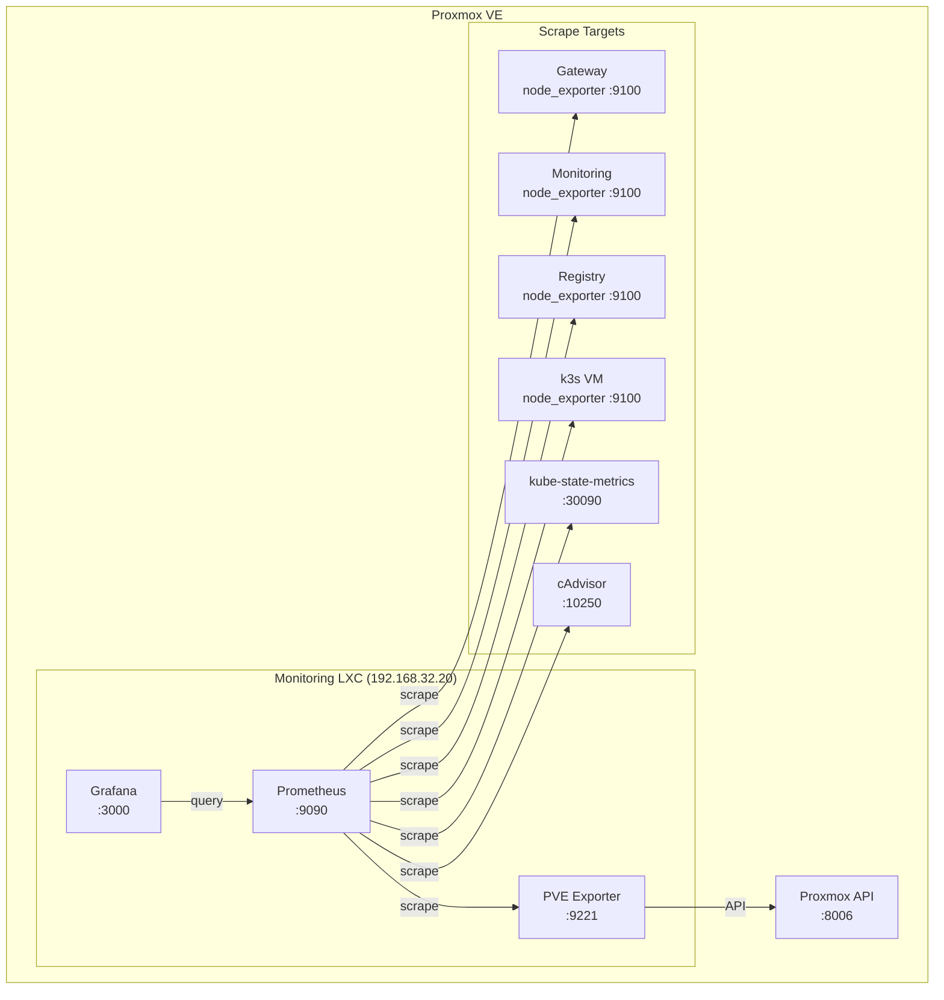

# Home Lab 모니터링: Prometheus + Grafana

> 목표: **"지금 서버 상태가 어때?"**에 대시보드 하나로 답하기.
> 결과: 노드, 컨테이너, 서비스 메트릭을 한눈에 확인하고, 문제가 생기면 알림 받기.

---

## 배경: 왜 모니터링이 필요했나

[이전 글](/home-lab-iac)에서 Terraform + Ansible로 인프라를 코드화했다. 그런데 코드화만으로는 "지금 서버가 잘 돌아가고 있는지"를 알 수 없다. SSH로 접속해서 `htop`을 띄워보는 건 원시적이고, 여러 노드를 한 번에 보기 어렵다.

회사에서 DataDog이나 Grafana Cloud 같은 SaaS를 쓰다 보니, 집에서도 비슷한 경험을 원했다. 다행히 Prometheus + Grafana 조합은 오픈소스로 충분히 구축 가능하고, 홈랩 규모에서는 리소스도 많이 안 먹는다.

---

## 모니터링 아키텍처



### 구성 요소

| 컴포넌트 | 역할 | 비고 |
|---------|------|------|
| **Prometheus** | 메트릭 수집/저장 | 15초 간격 scrape, 15일 보존 |
| **Grafana** | 대시보드/시각화 | Prometheus datasource 연결 |
| **node_exporter** | 노드 메트릭 | CPU, 메모리, 디스크, 네트워크 |
| **pve-exporter** | Proxmox 메트릭 | VM/LXC 상태, 리소스 사용량 |
| **kube-state-metrics** | K8s 오브젝트 메트릭 | Pod, Deployment 상태 |
| **cAdvisor** | 컨테이너 메트릭 | kubelet 내장 |

---

## Prometheus 구성

### 스크랩 대상 정의

Ansible에서 `prometheus_scrape_configs` 변수로 스크랩 대상을 관리한다. IP 주소는 `hosts_ip` 변수를 참조해서 하드코딩을 피했다:

```yaml
prometheus_scrape_configs:
  - job_name: "prometheus"
    static_configs:
      - targets: ["localhost:9090"]

  # LXC 노드 메트릭
  - job_name: "node-lxc"
    static_configs:
      - targets:
          - "{{ hosts_ip.gateway }}:9100"
          - "{{ hosts_ip.monitoring }}:9100"
          - "{{ hosts_ip.registry }}:9100"
          - "{{ hosts_ip.nextcloud }}:9100"

  # K8s 노드 메트릭
  - job_name: "node-k8s"
    static_configs:
      - targets:
          - "{{ hosts_ip.k8s }}:9100"

  # Proxmox VE 메트릭
  - job_name: "pve"
    static_configs:
      - targets: ["localhost:9221"]
    metrics_path: /pve
    params:
      target: ["{{ hosts_ip.pve }}"]

  # K8s kube-state-metrics
  - job_name: "kube-state-metrics"
    static_configs:
      - targets: ["{{ hosts_ip.k8s }}:30090"]

  # 애플리케이션 메트릭
  - job_name: "selectchatgpt"
    static_configs:
      - targets: ["{{ hosts_ip.k8s }}:30301"]
    metrics_path: /metrics
```

### Proxmox Exporter

Proxmox의 메트릭을 수집하려면 pve-exporter가 필요하다. 이건 Proxmox API에 접근해서 VM/LXC 상태, CPU, 메모리, 스토리지 사용량을 가져온다:

```yaml
# pve-exporter 설정
pve_exporter_config:
  default:
    user: prometheus@pve
    token_name: prometheus
    token_value: "{{ pve_prometheus_token }}"
    verify_ssl: false
```

Proxmox 웹 UI에서 API 토큰을 생성하고, Ansible Vault로 암호화해서 관리한다.

### Kubernetes 메트릭

k3s 클러스터의 메트릭은 두 가지 방식으로 수집한다:

1. **kube-state-metrics**: NodePort(30090)로 노출. Pod, Deployment, Service 등 K8s 오브젝트 상태
2. **cAdvisor**: kubelet 내장. 컨테이너별 CPU, 메모리 사용량

cAdvisor는 HTTPS와 인증이 필요해서 설정이 조금 복잡하다:

```yaml
- job_name: "kubernetes-cadvisor"
  scheme: https
  tls_config:
    insecure_skip_verify: true
  bearer_token_file: /etc/prometheus/k8s-token
  static_configs:
    - targets: ["{{ hosts_ip.k8s }}:10250"]
  metrics_path: /metrics/cadvisor
```

ServiceAccount 토큰을 미리 생성해서 `/etc/prometheus/k8s-token`에 배포해둬야 한다.

---

## Grafana 구성

### 자동 프로비저닝

Grafana의 장점 중 하나는 설정 파일로 datasource와 대시보드를 프로비저닝할 수 있다는 것이다. 웹 UI에서 수동으로 설정할 필요가 없다:

```yaml
# /etc/grafana/provisioning/datasources/prometheus.yml
apiVersion: 1
datasources:
  - name: Prometheus
    type: prometheus
    uid: prometheus
    access: proxy
    url: http://localhost:9090
    isDefault: true
    editable: false
```

대시보드도 JSON 파일로 관리한다. Grafana Labs에서 인기 있는 대시보드를 다운로드하면 된다:

- **Node Exporter Full** (ID: 1860): 노드 메트릭 종합
- **Proxmox** (ID: 10347): Proxmox 클러스터 현황
- **Kubernetes Cluster** (ID: 15759): K8s 오브젝트 상태

### LXC 호환성 이슈

Grafana를 LXC 컨테이너에서 실행하면 systemd 보안 기능 때문에 시작이 안 될 수 있다. 이걸 해결하려면 systemd override가 필요하다:

```ini
# /etc/systemd/system/grafana-server.service.d/override.conf
[Service]
PrivateDevices=false
PrivateTmp=false
ProtectSystem=false
# ... 기타 보안 옵션 비활성화
```

LXC는 호스트 커널을 공유하기 때문에 일부 격리 기능이 동작하지 않는다. 보안상 이상적이지는 않지만, 홈랩 환경에서는 감수할 만하다.

---

## 대시보드 설계

### 홈 대시보드

첫 화면에서 전체 현황을 파악할 수 있어야 한다. 내가 구성한 홈 대시보드의 패널들:

1. **시스템 상태 요약**: 전체 노드 수, 실행 중인 컨테이너 수, 알림 현황
2. **리소스 사용률**: CPU, 메모리, 디스크 사용률 (노드별)
3. **네트워크 트래픽**: 인바운드/아웃바운드 트래픽
4. **최근 이벤트**: Pod 재시작, 노드 상태 변경 등

```
┌─────────────────────────────────────────────────────────────┐
│ Home Lab Overview                                           │
├─────────────┬─────────────┬─────────────┬───────────────────┤
│  6 Nodes    │  12 Pods    │  0 Alerts   │  99.9% Uptime     │
│    ●●●      │    ●●●      │    ✓        │    ▁▂▃▅▇         │
├─────────────┴─────────────┴─────────────┴───────────────────┤
│ CPU Usage by Node                    Memory Usage by Node   │
│ ┌────────────────────────┐          ┌────────────────────┐  │
│ │ gateway    ███░░ 32%   │          │ gateway   ██░░ 45% │  │
│ │ monitoring ████░ 48%   │          │ monitoring████ 72% │  │
│ │ registry   █░░░░ 12%   │          │ registry  ██░░ 38% │  │
│ │ k8s        ██████ 67%  │          │ k8s       █████ 85%│  │
│ └────────────────────────┘          └────────────────────┘  │
└─────────────────────────────────────────────────────────────┘
```

### 서비스별 대시보드

각 서비스마다 전용 대시보드를 만들었다. 예를 들어 SelectChatGPT 대시보드:

- **요청 처리량**: 분당 요청 수, 성공/실패 비율
- **응답 시간**: p50, p95, p99 레이턴시
- **토큰 사용량**: API 호출당 토큰 수
- **에러 로그**: 최근 에러 메시지

애플리케이션에서 `/metrics` 엔드포인트를 노출하면 Prometheus가 자동으로 수집한다.

---

## 알림 설정

### Alertmanager 연동

Prometheus의 알림은 Alertmanager를 통해 처리된다. 현재는 간단하게 Discord webhook으로 알림을 보내고 있다:

```yaml
# alertmanager.yml
route:
  receiver: 'discord'
  group_wait: 30s
  group_interval: 5m
  repeat_interval: 4h

receivers:
  - name: 'discord'
    discord_configs:
      - webhook_url: 'https://discord.com/api/webhooks/...'
```

### 알림 규칙

자주 발생하는 문제를 감지하는 규칙들:

```yaml
groups:
  - name: node
    rules:
      - alert: HighCPUUsage
        expr: 100 - (avg by(instance) (rate(node_cpu_seconds_total{mode="idle"}[5m])) * 100) > 80
        for: 5m
        labels:
          severity: warning
        annotations:
          summary: "High CPU usage on {{ $labels.instance }}"

      - alert: HighMemoryUsage
        expr: (1 - node_memory_MemAvailable_bytes / node_memory_MemTotal_bytes) * 100 > 90
        for: 5m
        labels:
          severity: critical

      - alert: DiskSpaceLow
        expr: (1 - node_filesystem_avail_bytes / node_filesystem_size_bytes) * 100 > 85
        for: 10m
        labels:
          severity: warning
```

실제로 디스크 용량 알림 덕분에 Registry 스토리지가 가득 차기 전에 정리할 수 있었다.

---

## 운영 경험

### 좋았던 점

1. **문제 조기 발견**: 메모리 누수가 있는 컨테이너를 그래프에서 먼저 발견. 점진적으로 메모리가 증가하는 패턴이 보였다
2. **용량 계획**: 디스크 사용량 추이를 보고 언제 확장이 필요할지 예측 가능
3. **장애 분석**: 문제가 발생했을 때 "언제부터 이상했는지"를 정확히 파악

### 아쉬운 점

1. **로그 통합 부재**: 현재 메트릭만 수집하고 로그는 따로 관리. Loki 도입을 고려 중
2. **대시보드 유지보수**: 서비스가 추가될 때마다 대시보드도 업데이트해야 함
3. **스토리지**: 15일 보존이지만 메트릭이 많아지면 디스크를 꽤 먹음

---

## 맺음말

모니터링은 "있으면 좋은 것"이 아니라 "없으면 안 되는 것"이었다. 특히 여러 서비스를 운영하면서 각각의 상태를 파악하는 게 중요해졌다.

Prometheus + Grafana 조합은 홈랩 규모에서 충분히 강력하다. 설치도 어렵지 않고, 커뮤니티 대시보드가 많아서 처음 시작하기 좋다. 다만 처음에는 "어떤 메트릭을 봐야 하는지"를 모르기 때문에, 실제로 문제가 생겼을 때 하나씩 추가하는 방식으로 발전시켜 나가는 게 현실적이다.

---

## 참고

- [Prometheus Getting Started](https://prometheus.io/docs/prometheus/latest/getting_started/)
- [Grafana Provisioning](https://grafana.com/docs/grafana/latest/administration/provisioning/)
- [Node Exporter](https://github.com/prometheus/node_exporter)
- [PVE Exporter](https://github.com/prometheus-pve/prometheus-pve-exporter)
- [kube-state-metrics](https://github.com/kubernetes/kube-state-metrics)
