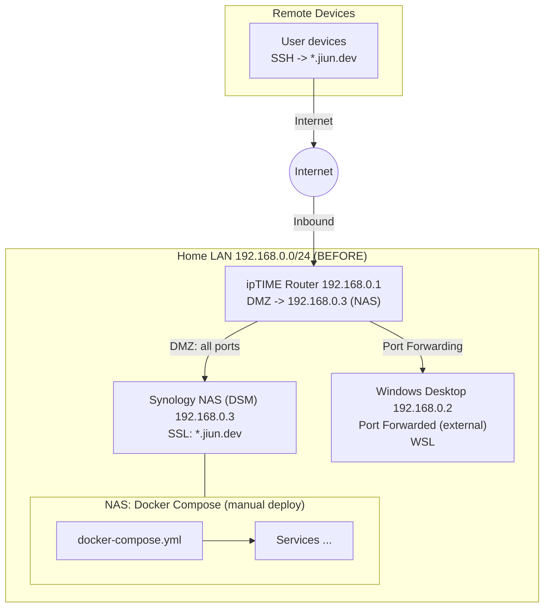
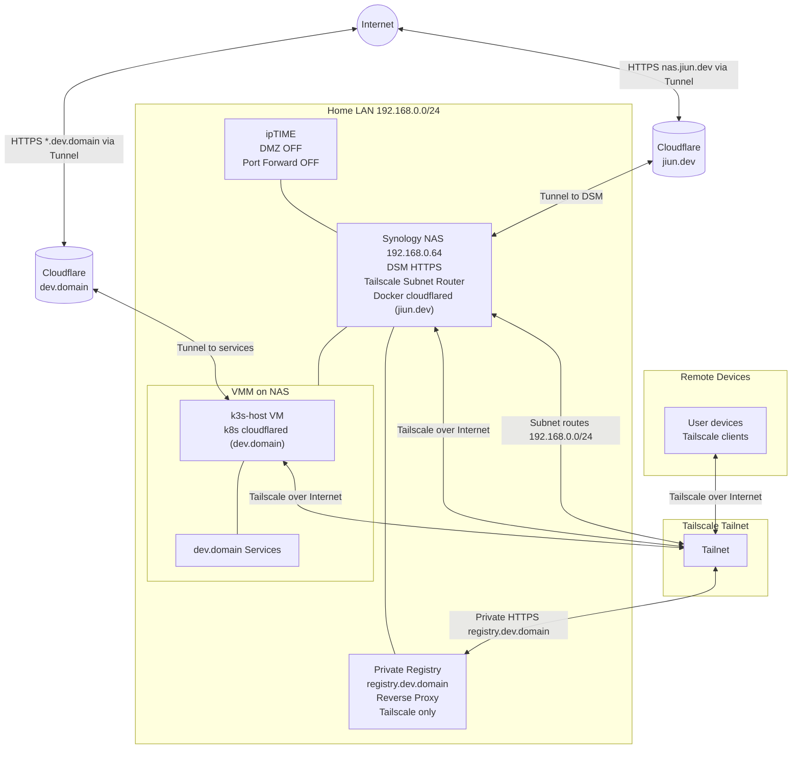

# Home Lab 네트워크 “DMZ/Port Forward”에서 “Tailscale + Cloudflare Tunnel”로 갈아탄 기록

> 목표: **공개 노출은 최소(필요한 것만)**, 나머지는 **전부 private**로.  
> 결과: Router inbound(Port Forward/DMZ) “0”에 가깝게 만들고, 관리/운영이 쉬워졌다.

---

## 배경: 왜 갈아탔나

처음에는 공유기(`ipTIME`)에서 **DMZ + Port Forward**로 외부에서 집 NAS/PC로 들어오게 만들었다. 편리했지만 여러 보안적 문제들이 있음에도 눈감고 10년정도 사용했다. 최근에 Tailscale에 대한 여러 긍정적 이야기를 듣기도 했고, 홈 서버에서 제대로 서비스를 배포해보고 싶어서 그리고 LLM의 도움을 받아서 쉽고 빠르게 설정할 수 있을것 같아 이번 기회에 공부하며 환경을 구성했다.

---

## 기존 구성

---

## 설계 목표

- Public:
  - `nas.jiun.dev` 하나(= DSM 관리 UI)만, **Cloudflare Tunnel**로 공개
- Private:
  - Home LAN(192.168.0.0/24) 접근은 **Tailscale Subnet Router**로만
  - `registry.dev.domain`는 **Tailscale 내부에서만** Push/Pull
- 운영:
  - `dev.domain`는 서비스가 많아질 것이므로 **k3s + IaC(kubectl)**로 유지
  - `jiun.dev`는 cloudflared만 필요해서 **DSM Docker**로 분리 운영

---

## 현재 구성

---

## 구현 요약

### 1) ipTIME: DMZ/Port Forward 끄기

- DMZ OFF
- Port Forward OFF

### 2) Tailscale: NAS를 Subnet Router로

NAS가 `192.168.0.0/24` route를 advertise 하고, Tailnet Admin에서 승인해서 “집 내부 IP로 접근”을 가능하게 만들었다. Subnet Router는 “특정 사설 Subnet만 tailnet에 연결”하는 패턴이라, Exit Node(전체 트래픽 우회)와 개념이 다르다.[^tailscale-subnet]

추가로, ACL/Tags를 붙이면 “누가 Home LAN에 들어올 수 있는지”를 강제할 수 있다.[^tailscale-acl][^tailscale-tags]

### 3) Cloudflare Tunnel(jiun.dev): DSM만 Public으로

DSM은 `https://<NAS>` 형태로 내부에서 잘 열리는 걸 확인한 뒤, `nas.jiun.dev`를 Cloudflare Tunnel의 **Public Hostname**으로 publish하고, origin을 `https://127.0.0.1:6006`로 지정했다(DSM Docker에서 cloudflared 실행). Tunnel은 “공개 Hostname → 내부 origin”을 매핑하는 모델이다.[^cf-tunnel-routing]

DSM 인증서가 내부 전용이라 TLS 검증이 실패하면, cloudflared에서 **No TLS Verify**(또는 동등 설정)가 필요할 수 있다.[^cf-origin-params]

그리고 DSM 같은 관리면은 Cloudflare Access로 잠그는 게 깔끔하다(최소한 계정/MFA).[^cf-access-selfhosted]

### 4) Cloudflare Tunnel(dev.domain): k3s에 IaC로 유지

`dev.domain`는 서비스가 많아서 k3s에 이미 IaC로 cloudflared를 배포 중이라, 기존 패턴(Deployment + Secret) 그대로 유지했다. 즉:

- `dev.domain`: k3s cloudflared (k8s Deployment)
- `jiun.dev`: DSM Docker cloudflared (container 1개)

### 5) registry.dev.domain: private-only(Tailscale 내부에서만)

Registry는 Reverse Proxy 구조 자체는 유지하되, 실제 접근은 Tailscale 내부에서만 하도록 했다.

- Cloudflare Tunnel/Public Hostname에서 `registry.dev.domain`는 제외
- NAS Firewall에서 `100.64.0.0/10`(Tailscale)만 443 허용 같은 식으로 강제
- Split DNS로 `registry.dev.domain`가 tailnet 내부 IP로 해석되게 구성

---

## 결론

이번 Migration의 핵심은 기능 추가가 아니라 “경계 정리”였다.

- Router inbound를 없애고(DMZ/Port Forward OFF)
- Private는 Tailscale로 단일화하고
- Public은 Cloudflare Tunnel로 단일화했다

이렇게 하니 보안/운영/확장성(Domain 추가, 서비스 추가)이 동시에 좋아졌다.

특히 Tailscale을 사용해보고서 기능적 장점들도 많았지만 심리스하게 잘 동작한다는 점에서 매우 마음에 들었다.

- Inbound 없이 내부 네트워크처럼 붙고 WireGuard 기반이라 빠르고 운영이 쉽다.
- 대부분 환경에서 Direct로 붙고 필요한경우 DERP relay로 자동 전환되기 때문에 안정적이다.
- Subnet Router로 `192.168.0.0/24` 처럼 LAN 전체를 내부망처럼 접근할 수 있어서 편리하다.
- ACL/Tags로 “누가 어디에 접근할 수 있는지”를 세밀하게 제어할 수 있다.

미뤄뒀던 짐을 하나씩 정리하는 기분이 들었고, 앞으로도 집 개발 환경을 더 잘 활용할 수 있을 것 같다.

---

## 각주/참고

[^tailscale-subnet]: Tailscale Subnet routers: https://tailscale.com/kb/1019/subnets
[^tailscale-acl]: Tailscale ACLs: https://tailscale.com/kb/1018/acls
[^tailscale-tags]: Tailscale Tags: https://tailscale.com/kb/1068/tags
[^cf-tunnel-routing]: Cloudflare Tunnel routing(Public Hostname → origin): https://developers.cloudflare.com/cloudflare-one/networks/connectors/cloudflare-tunnel/routing-to-tunnel/
[^cf-origin-params]: cloudflared origin parameters(No TLS Verify 등): https://developers.cloudflare.com/cloudflare-one/networks/connectors/cloudflare-tunnel/configure-tunnels/cloudflared-parameters/origin-parameters/
[^cf-access-selfhosted]: Cloudflare Access(Self-hosted apps): https://developers.cloudflare.com/cloudflare-one/access-controls/applications/http-apps/self-hosted-public-app/
