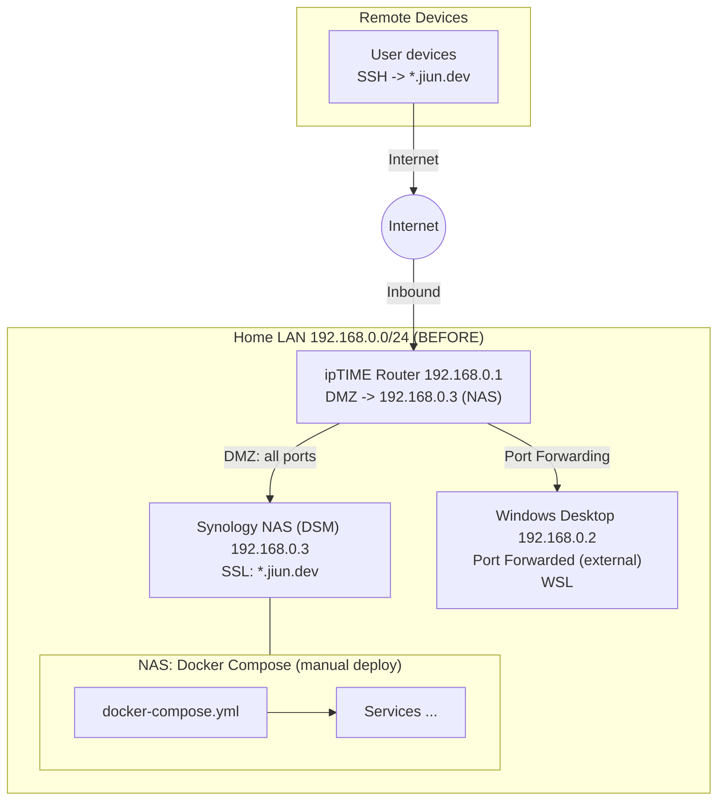
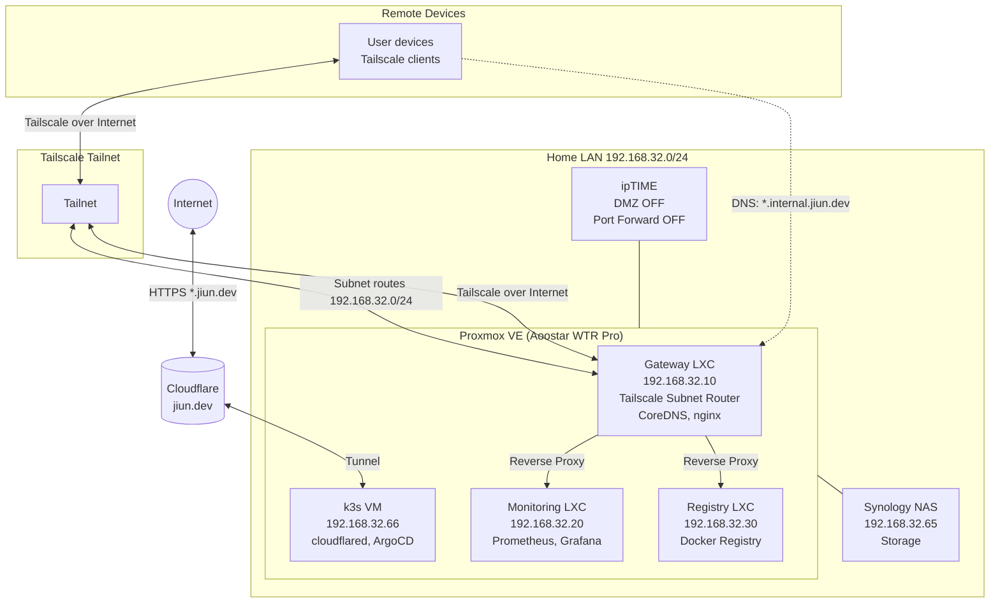

# Home Lab 네트워크 “DMZ/Port Forward”에서 “Tailscale + Cloudflare Tunnel”로 갈아탄 기록

> 목표: **공개 노출은 최소(필요한 것만)**, 나머지는 **전부 private**로.  
> 결과: Router inbound(Port Forward/DMZ) “0”에 가깝게 만들고, 관리/운영이 쉬워졌다.

---

## 배경: 왜 갈아탔나

처음에는 공유기(`ipTIME`)에서 **DMZ + Port Forward**로 외부에서 집 NAS/PC로 들어오게 만들었다. 편리했지만 여러 보안적 문제들이 있음에도 눈감고 10년정도 사용했다. 최근에 Tailscale에 대한 여러 긍정적 이야기를 듣기도 했고, 홈 서버에서 제대로 서비스를 배포해보고 싶어서 그리고 LLM의 도움을 받아서 쉽고 빠르게 설정할 수 있을것 같아 이번 기회에 공부하며 환경을 구성했다.

---

## 기존 구성



---

## 설계 목표

- Public:
  - `nas.jiun.dev` 하나(= DSM 관리 UI)만, **Cloudflare Tunnel**로 공개
- Private:
  - Home LAN(192.168.0.0/24) 접근은 **Tailscale Subnet Router**로만
  - `registry.dev.domain`는 **Tailscale 내부에서만** Push/Pull
- 운영:
  - `dev.domain`는 서비스가 많아질 것이므로 **k3s + IaC(kubectl)**로 유지
  - `jiun.dev`는 cloudflared만 필요해서 **DSM Docker**로 분리 운영

---

## 현재 구성



### 구성 변경 사항 (2024.12 → 2025.01)

초기 구성 이후 몇 가지 변경이 있었다:

- **NAS VMM → Proxmox VE**: Synology NAS의 VMM은 리소스가 제한적이라 별도 미니 PC(Aoostar WTR Pro)에 Proxmox VE를 설치했다. 저전력이면서 코어 수가 충분해서 가상화 용도로 적합했다
- **역할 분리**: 모든 서비스를 NAS에서 돌리던 것을 LXC/VM으로 분리. Gateway, Monitoring, Registry, k3s 각각 독립적으로 운영
- **Subnet Router 이전**: NAS에서 Gateway LXC로 Tailscale Subnet Router를 옮겼다. 네트워크 진입점을 한 곳으로 모으기 위해
- **CoreDNS 도입**: Split DNS를 위해 Gateway에 CoreDNS를 설치. 내부에서는 `*.internal.jiun.dev`로 접근

> 이후 이 구성을 Terraform + Ansible로 코드화했다. 자세한 내용은 [Home Lab IaC](/posts/home-lab-iac) 글 참고.

---

## 구현 요약

### 1) ipTIME: DMZ/Port Forward 끄기

- DMZ OFF
- Port Forward OFF

### 2) Tailscale: NAS를 Subnet Router로

NAS가 `192.168.0.0/24` route를 advertise 하고, Tailnet Admin에서 승인해서 “집 내부 IP로 접근”을 가능하게 만들었다. Subnet Router는 “특정 사설 Subnet만 tailnet에 연결”하는 패턴이라, Exit Node(전체 트래픽 우회)와 개념이 다르다.[^tailscale-subnet]

추가로, ACL/Tags를 붙이면 “누가 Home LAN에 들어올 수 있는지”를 강제할 수 있다.[^tailscale-acl][^tailscale-tags]

### 3) Cloudflare Tunnel(jiun.dev): DSM만 Public으로

DSM은 `https://<NAS>` 형태로 내부에서 잘 열리는 걸 확인한 뒤, `nas.jiun.dev`를 Cloudflare Tunnel의 **Public Hostname**으로 publish하고, origin을 `https://127.0.0.1:6006`로 지정했다(DSM Docker에서 cloudflared 실행). Tunnel은 “공개 Hostname → 내부 origin”을 매핑하는 모델이다.[^cf-tunnel-routing]

DSM 인증서가 내부 전용이라 TLS 검증이 실패하면, cloudflared에서 **No TLS Verify**(또는 동등 설정)가 필요할 수 있다.[^cf-origin-params]

그리고 DSM 같은 관리면은 Cloudflare Access로 잠그는 게 깔끔하다(최소한 계정/MFA).[^cf-access-selfhosted]

### 4) Cloudflare Tunnel(dev.domain): k3s에 IaC로 유지

`dev.domain`는 서비스가 많아서 k3s에 이미 IaC로 cloudflared를 배포 중이라, 기존 패턴(Deployment + Secret) 그대로 유지했다. 즉:

- `dev.domain`: k3s cloudflared (k8s Deployment)
- `jiun.dev`: DSM Docker cloudflared (container 1개)

### 5) registry.dev.domain: private-only(Tailscale 내부에서만)

Registry는 Reverse Proxy 구조 자체는 유지하되, 실제 접근은 Tailscale 내부에서만 하도록 했다.

- Cloudflare Tunnel/Public Hostname에서 `registry.dev.domain`는 제외
- NAS Firewall에서 `100.64.0.0/10`(Tailscale)만 443 허용 같은 식으로 강제
- Split DNS로 `registry.dev.domain`가 tailnet 내부 IP로 해석되게 구성

---

## Split DNS와 CoreDNS

내부 서비스에 접근할 때 IP 주소를 외우고 싶지 않았다. `grafana.internal.jiun.dev`처럼 도메인으로 접근하고 싶었는데, 문제는 이 도메인이 외부에서는 해석되면 안 된다는 것이다. 이걸 해결하는 게 Split DNS다.

### Split DNS란

같은 도메인이라도 **어디서 질의하느냐에 따라 다른 IP를 반환**하는 구성이다:

| 도메인                      | 외부(인터넷)        | 내부(Tailscale)          |
| --------------------------- | ------------------- | ------------------------ |
| `grafana.jiun.dev`          | Cloudflare → Tunnel | 해석 안 됨 (또는 Tunnel) |
| `grafana.internal.jiun.dev` | 해석 안 됨          | CoreDNS → 192.168.32.10  |

외부 사용자가 `internal.jiun.dev`를 질의해도 응답이 없다. 이 도메인은 오직 내부 DNS(CoreDNS)에서만 해석된다.

### CoreDNS 구성

Gateway LXC에 CoreDNS를 설치하고, Tailscale의 DNS 설정에서 이 서버를 지정했다. Corefile은 이렇게 생겼다:

```
internal.jiun.dev {
    hosts /etc/coredns/hosts.internal.jiun.dev {
        fallthrough
    }
    forward . 1.1.1.1 8.8.8.8
    log
    errors
}

jiun.dev {
    hosts /etc/coredns/hosts.jiun.dev {
        fallthrough
    }
    forward . 1.1.1.1 8.8.8.8
    log
    errors
}

. {
    forward . 1.1.1.1 8.8.8.8
    cache 30
    log
    errors
}
```

`internal.jiun.dev` 존은 hosts 파일에서 먼저 찾고, 없으면 upstream DNS로 forward한다. 나머지 도메인(`.`)은 그냥 upstream으로 보낸다.

### DNS 레코드 관리

hosts 파일은 이런 식으로 구성된다:

```
# /etc/coredns/hosts.internal.jiun.dev
192.168.32.10  grafana.internal.jiun.dev
192.168.32.10  prometheus.internal.jiun.dev
192.168.32.10  registry.internal.jiun.dev
192.168.32.10  argocd.internal.jiun.dev
192.168.32.10  pve.internal.jiun.dev
```

대부분의 서비스가 Gateway(192.168.32.10)를 가리키는 이유는, Gateway에서 nginx 리버스 프록시로 각 서비스에 라우팅하기 때문이다. 도메인별로 다른 백엔드로 보내는 구조다.

### Tailscale DNS 설정

Tailscale Admin Console에서 DNS 설정을 추가한다:

1. **Nameservers**: `192.168.32.10` (Gateway)를 Split DNS로 추가
2. **Split DNS domains**: `internal.jiun.dev`, `jiun.dev`

이렇게 하면 Tailscale 클라이언트는 `*.internal.jiun.dev` 질의를 Gateway로 보내고, Gateway의 CoreDNS가 내부 IP를 반환한다.

결과적으로 Tailscale에 연결된 상태에서 `grafana.internal.jiun.dev`를 브라우저에 입력하면 내부 Grafana에 접속된다. 외부에서는 이 도메인이 존재하지 않는 것처럼 보인다.

---

## 보안 관점에서 본 변경

단순히 "편해졌다"가 아니라, 보안 측면에서도 의미 있는 개선이었다.

### DMZ/Port Forward의 위험성

기존 구성의 문제점을 정리하면:

| 위험 요소              | 설명                                                                     |
| ---------------------- | ------------------------------------------------------------------------ |
| **공격 표면 확대**     | DMZ로 NAS 전체 포트가 인터넷에 노출. 취약점 하나로 전체 시스템 침해 가능 |
| **무차별 대입 공격**   | SSH, DSM 로그인 페이지가 외부에서 접근 가능. 봇에 의한 brute force 시도  |
| **내부망 침투 경로**   | NAS가 뚫리면 같은 LAN의 다른 장비(PC, IoT 등)도 위험                     |
| **암호화 미적용 구간** | 일부 서비스가 HTTP로 노출될 경우 MITM 가능                               |

10년간 별일 없었던 건 운이 좋았던 것일 수 있다. 취약점이 발견되거나 잘못된 설정이 있었다면 피해를 입었을 것이다.
~~사실 ssh 포트만 열어뒀는데 무차별 대입 공격 시도는 빈번했었다.~~

### Zero Trust 접근

새 구성은 "Zero Trust" 원칙에 가깝다:

1. **네트워크 위치를 신뢰하지 않음**: 사내망이든 집이든 Tailscale 인증 없이는 접근 불가
2. **기본 차단, 명시적 허용**: Router inbound를 전부 막고, Cloudflare Tunnel로 필요한 것만 노출
3. **최소 권한**: 각 서비스별로 접근 권한을 Tailscale ACL로 제어 가능

```json
// Tailscale ACL 예시
{
  "acls": [
    {
      "action": "accept",
      "src": ["tag:admin"],
      "dst": ["192.168.32.0/24:*"]
    },
    {
      "action": "accept",
      "src": ["tag:developer"],
      "dst": ["192.168.32.66:443"] // k8s만 허용
    }
  ]
}
```

### 계층별 보안

현재 구성의 보안 계층을 정리하면:

```
┌─────────────────────────────────────────────────────────┐
│ Layer 1: Network (Router)                               │
│ - Inbound 전체 차단 (DMZ OFF, Port Forward OFF)           │
│ - 물리적으로 외부에서 내부망 접근 불가                           │
└─────────────────────────────────────────────────────────┘
                          ↓
┌─────────────────────────────────────────────────────────┐
│ Layer 2: Overlay Network (Tailscale)                    │
│ - WireGuard 기반 암호화 (상시 E2E 암호화)               │
│ - 디바이스별 인증 (SSO 연동 가능)                       │
│ - ACL로 접근 제어                                       │
└─────────────────────────────────────────────────────────┘
                          ↓
┌─────────────────────────────────────────────────────────┐
│ Layer 3: Application Gateway (Cloudflare Tunnel)        │
│ - 외부 노출 서비스만 선택적 publish                     │
│ - Cloudflare Access로 추가 인증 (MFA)                   │
│ - DDoS 보호, WAF 적용 가능                              │
└─────────────────────────────────────────────────────────┘
                          ↓
┌─────────────────────────────────────────────────────────┐
│ Layer 4: Service Level                                  │
│ - 각 서비스별 자체 인증 (Grafana, ArgoCD 등)            │
│ - HTTPS 강제 (Let's Encrypt 또는 Cloudflare Origin CA) │
└─────────────────────────────────────────────────────────┘
```

각 계층이 독립적으로 동작해서, 한 계층이 뚫려도 다음 계층에서 막을 수 있다.

---

## 결론

이번 Migration의 핵심은 기능 추가가 아니라 “경계 정리”였다.

- Router inbound를 없애고(DMZ/Port Forward OFF)
- Private는 Tailscale로 단일화하고
- Public은 Cloudflare Tunnel로 단일화했다

이렇게 하니 보안/운영/확장성(Domain 추가, 서비스 추가)이 동시에 좋아졌다.

특히 Tailscale을 사용해보고서 기능적 장점들도 많았지만 심리스하게 잘 동작한다는 점에서 매우 마음에 들었다.

- Inbound 없이 내부 네트워크처럼 붙고 WireGuard 기반이라 빠르고 운영이 쉽다.
- 대부분 환경에서 Direct로 붙고 필요한경우 DERP relay로 자동 전환되기 때문에 안정적이다.
- Subnet Router로 `192.168.0.0/24` 처럼 LAN 전체를 내부망처럼 접근할 수 있어서 편리하다.
- ACL/Tags로 “누가 어디에 접근할 수 있는지”를 세밀하게 제어할 수 있다.

미뤄뒀던 짐을 하나씩 정리하는 기분이 들었고, 앞으로도 집 개발 환경을 더 잘 활용할 수 있을 것 같다.

---

## 각주/참고

[^tailscale-subnet]: Tailscale Subnet routers: https://tailscale.com/kb/1019/subnets
[^tailscale-acl]: Tailscale ACLs: https://tailscale.com/kb/1018/acls
[^tailscale-tags]: Tailscale Tags: https://tailscale.com/kb/1068/tags
[^cf-tunnel-routing]: Cloudflare Tunnel routing(Public Hostname → origin): https://developers.cloudflare.com/cloudflare-one/networks/connectors/cloudflare-tunnel/routing-to-tunnel/
[^cf-origin-params]: cloudflared origin parameters(No TLS Verify 등): https://developers.cloudflare.com/cloudflare-one/networks/connectors/cloudflare-tunnel/configure-tunnels/cloudflared-parameters/origin-parameters/
[^cf-access-selfhosted]: Cloudflare Access(Self-hosted apps): https://developers.cloudflare.com/cloudflare-one/access-controls/applications/http-apps/self-hosted-public-app/

### 추가 참고

- [CoreDNS Manual](https://coredns.io/manual/toc/)
- [Tailscale Split DNS](https://tailscale.com/kb/1054/dns)
- [Zero Trust Security Model (NIST)](https://www.nist.gov/publications/zero-trust-architecture)
