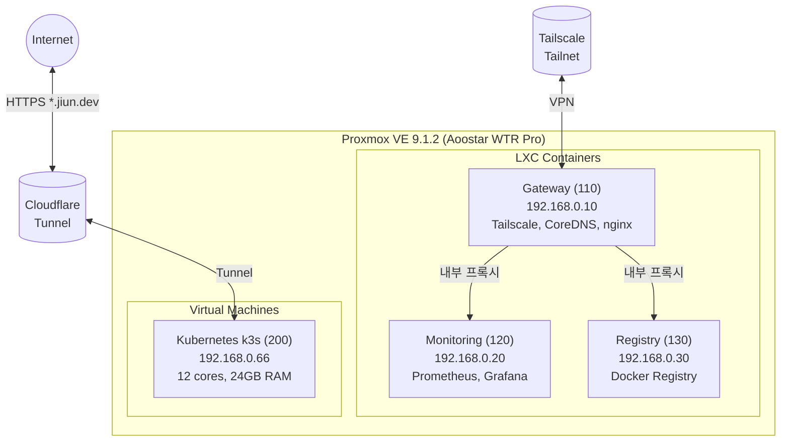
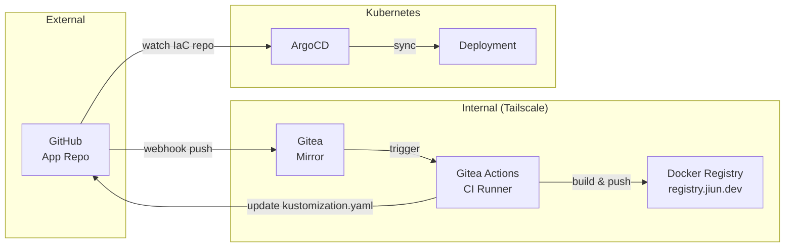
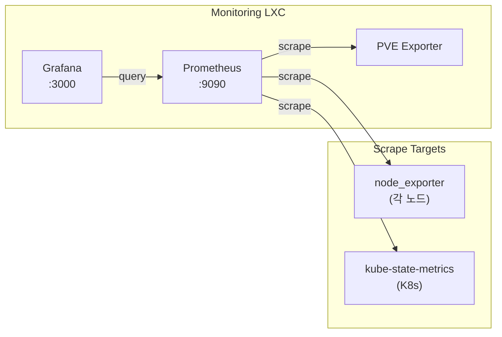

# Home Lab 인프라를 코드로 관리하기: Terraform + Ansible

> 목표: **"서버 날아가면 그냥 다시 돌리면 돼"**를 현실로 만들기.
> 결과: 수동 설정 0, 재현 가능한 인프라, 그리고 마음의 평화.

---

## 배경: 왜 IaC를 도입했나

[이전 글](/home-dev)에서 Tailscale과 Cloudflare Tunnel로 네트워크를 정리한 이야기를 했었다. 그 과정에서 자연스럽게 "이 설정들을 어떻게 관리하지?"라는 고민이 생겼다.

처음에는 그냥 서버에 SSH로 접속해서 하나씩 설정했다. Tailscale 설치하고, nginx 설정하고, Docker 컨테이너 띄우고. 문제는 이게 쌓이면서 "내가 뭘 어떻게 설정했더라?"를 기억하기 어려워졌다는 것이다. 특히 몇 달 후에 서버를 재설정해야 할 때, 과거의 내가 무슨 짓을 했는지 알 수 없는 상황이 생겼다.

회사에서 Kubernetes나 Terraform을 사용하면서 인프라를 코드로 관리하는 경험을 했었고, 집에서도 비슷하게 해보고 싶다는 생각이 있었다. 마침 LLM의 도움을 받으면 익숙하지 않은 도구도 빠르게 배울 수 있을 것 같아서 이번 기회에 제대로 구성해보기로 했다.

---

## 현재 인프라 구성

먼저 현재 Home Lab의 물리적 구성을 설명하면, Aoostar WTR Pro라는 미니 PC에 Proxmox VE를 설치해서 사용하고 있다. 저전력이면서도 코어 수가 충분해서 가상화 용도로 적합했다.



### 왜 이런 구조인가

처음에는 모든 것을 Docker Compose로 NAS에서 돌렸다. 간단하고 편했지만, 서비스가 늘어나면서 관리가 어려워졌고 NAS가 재부팅되면 모든 서비스가 함께 내려갔다.

Proxmox로 마이그레이션하면서 역할별로 분리했다:

- **Gateway LXC**: 네트워크 진입점. Tailscale Subnet Router로 내부망 접근을 담당하고, 내부 서비스들의 리버스 프록시 역할
- **Monitoring LXC**: Prometheus + Grafana. 메트릭 수집과 대시보드
- **Registry LXC**: Private Docker Registry. 내부에서만 접근 가능
- **k3s VM**: 외부 공개 서비스는 Kubernetes에서 관리. Cloudflare Tunnel로 노출

이렇게 분리하니 하나가 죽어도 다른 서비스에 영향이 없고, 필요한 리소스만 할당할 수 있어서 효율적이었다.

---

## IaC 구조 설계

인프라를 코드로 관리하기 위해 Terraform과 Ansible을 조합했다. 역할 분담은 이렇다:

| 도구          | 담당 영역         | 예시                                    |
| ------------- | ----------------- | --------------------------------------- |
| **Terraform** | 인프라 프로비저닝 | LXC/VM 생성, 네트워크 설정, 디스크 할당 |
| **Ansible**   | 설정 관리         | 패키지 설치, 서비스 설정, 인증서 발급   |

이 분리가 중요한 이유는, "무엇을 만들 것인가"와 "어떻게 설정할 것인가"가 다른 문제이기 때문이다. Terraform은 선언적으로 인프라 상태를 정의하고, Ansible은 그 위에서 실제 소프트웨어를 설치하고 설정한다.

```
IaC/
├── terraform/
│   ├── environments/homelab/     # 환경별 변수
│   └── modules/
│       ├── lxc-base/             # 재사용 가능한 LXC 모듈
│       └── vm-base/              # 재사용 가능한 VM 모듈
├── ansible/
│   ├── inventory/                # 호스트 정의
│   ├── playbooks/                # 실행 단위
│   └── roles/                    # 서비스별 역할
│       ├── common/               # 공통 설정 (timezone, packages)
│       ├── tailscale/            # VPN 설정
│       ├── nginx/                # 리버스 프록시
│       ├── prometheus/           # 메트릭 수집
│       ├── grafana/              # 대시보드
│       └── k3s/                  # Kubernetes
├── kubernetes/                   # k8s 매니페스트
│   ├── cloudflared/              # Cloudflare Tunnel
│   └── apps/                     # 애플리케이션
└── scripts/
    └── deploy.sh                 # 통합 배포 스크립트
```

---

## Terraform: 인프라 정의

### LXC 모듈화

처음에는 각 LXC마다 별도의 Terraform 파일을 만들었다. 그런데 Gateway, Monitoring, Registry가 거의 비슷한 구조여서 중복이 많았다. 이를 모듈로 추출했다:

```hcl
# modules/lxc-base/main.tf
resource "proxmox_virtual_environment_container" "lxc" {
  node_name   = var.node_name
  vm_id       = var.vmid
  description = var.description

  initialization {
    hostname = var.hostname
    ip_config {
      ipv4 {
        address = "${var.ip_address}/24"
        gateway = var.gateway
      }
    }
  }

  cpu {
    cores = var.cores
  }

  memory {
    dedicated = var.memory
  }

  disk {
    datastore_id = var.datastore
    size         = var.disk_size
  }

  network_interface {
    name   = "eth0"
    bridge = "vmbr0"
  }

  operating_system {
    template_file_id = var.template
    type             = "debian"
  }
}
```

이제 새 LXC를 추가할 때는 모듈을 호출하기만 하면 된다:

```hcl
# environments/homelab/main.tf
module "gateway" {
  source      = "../../modules/lxc-base"
  vmid        = 110
  hostname    = "gateway"
  ip_address  = "192.168.0.10"
  cores       = 2
  memory      = 2048
  disk_size   = 8
  # ...
}

module "monitoring" {
  source      = "../../modules/lxc-base"
  vmid        = 120
  hostname    = "monitoring"
  ip_address  = "192.168.0.20"
  cores       = 2
  memory      = 4096
  disk_size   = 20
  # ...
}
```

### 상태 관리

Terraform은 `terraform.tfstate` 파일로 현재 인프라 상태를 추적한다. 처음에는 로컬에 저장했는데, 여러 장소에서 작업하다 보니 상태 충돌이 발생했다. 결국 MinIO(S3 호환)를 NAS에 띄우고 원격 백엔드로 사용하게 되었다.

```hcl
terraform {
  backend "s3" {
    bucket                      = "terraform-state"
    key                         = "homelab/terraform.tfstate"
    endpoint                    = "https://minio.internal.jiun.dev"
    skip_credentials_validation = true
    skip_metadata_api_check     = true
    force_path_style            = true
  }
}
```

---

## Ansible: 설정 관리

### 역할 기반 구조

Ansible의 장점은 역할(Role)로 설정을 캡슐화할 수 있다는 것이다. 예를 들어 `tailscale` 역할은 어떤 호스트에서든 Tailscale을 설치하고 설정한다:

```yaml
# roles/tailscale/tasks/main.yml
- name: Install Tailscale
  shell: curl -fsSL https://tailscale.com/install.sh | sh
  args:
    creates: /usr/bin/tailscale

- name: Start Tailscale
  command: tailscale up --authkey={{ tailscale_authkey }} --advertise-routes={{ tailscale_routes | default('') }}
  when: tailscale_authkey is defined
```

플레이북에서는 호스트별로 역할을 할당한다:

```yaml
# playbooks/site.yml
- hosts: gateway
  roles:
    - common
    - tailscale
    - coredns
    - nginx
    - certbot

- hosts: monitoring
  roles:
    - common
    - prometheus
    - grafana

- hosts: registry
  roles:
    - common
    - docker-registry
```

### 민감 정보 관리

API 토큰, 비밀번호 같은 민감 정보는 Ansible Vault로 암호화했다:

```bash
# 암호화
ansible-vault encrypt ansible/inventory/group_vars/all/secrets.yml

# 실행 시
ansible-playbook playbooks/site.yml --ask-vault-pass
```

처음에는 귀찮아서 평문으로 관리했는데, Git에 실수로 커밋할 뻔한 적이 있어서 바로 Vault로 전환했다.

---

## 배포 워크플로우

전체 배포는 하나의 스크립트로 실행한다:

```bash
#!/bin/bash
# scripts/deploy.sh

set -e

echo "=== Terraform Apply ==="
cd terraform/environments/homelab
terraform init
terraform apply -auto-approve

echo "=== Wait for LXC/VM to be ready ==="
sleep 30

echo "=== Ansible Playbook ==="
cd ../../../ansible
ansible-playbook playbooks/site.yml -i inventory/hosts.yml
```

새 서비스를 추가할 때의 흐름은 이렇다:

1. `terraform/environments/homelab/main.tf`에 LXC/VM 정의 추가
2. `ansible/roles/`에 새 역할 생성
3. `ansible/playbooks/site.yml`에 역할 할당
4. `./scripts/deploy.sh` 실행

처음 설정할 때는 시간이 걸리지만, 한 번 구조를 잡아두니 새 서비스 추가가 정말 빠르고 일관적이 되었다.

---

## GitOps: 코드 푸시만으로 배포까지

로컬에서 스크립트를 실행하는 방식도 나쁘지 않았지만, 결국 "코드를 푸시하면 자동으로 배포되는" GitOps를 도입하게 되었다. 특히 Kubernetes 위에서 돌아가는 서비스들은 ArgoCD와 Gitea를 활용해서 완전 자동화했다.

### 왜 GitHub + Gitea 조합인가

처음에는 GitHub Actions만 쓰려고 했다. 그런데 Private Docker Registry에 이미지를 푸시하려면 GitHub에서 내부 네트워크로 접근해야 하는 문제가 있었다. Tailscale을 GitHub Actions runner에 붙이는 방법도 있지만, 그보다는 내부에 CI를 두는 게 깔끔해 보였다.

그래서 Gitea를 Self-hosted로 띄우고, GitHub 레포를 미러링하는 구조를 만들었다:



개발할 때는 GitHub에 푸시하면 끝이다. webhook이 Gitea로 전달되고, Gitea Actions가 이미지를 빌드해서 내부 Registry에 푸시한다. 그리고 IaC 레포의 `kustomization.yaml`에서 이미지 태그를 업데이트하면, ArgoCD가 변경을 감지하고 Kubernetes에 배포한다.

### App Repo와 Config Repo 분리

GitOps의 핵심은 "애플리케이션 코드"와 "배포 설정"을 분리하는 것이다. 애플리케이션 레포에는 소스 코드와 Dockerfile만 있고, 실제 Kubernetes 매니페스트는 IaC 레포에 둔다:

```
# App Repo (예: claude-code-cloud)
├── src/                    # 애플리케이션 소스
├── Dockerfile              # 이미지 빌드
└── .gitea/workflows/
    └── deploy.yml          # CI 파이프라인

# IaC Repo
└── kubernetes/apps/claude-code-cloud/
    ├── application.yaml    # ArgoCD Application
    ├── kustomization.yaml  # 이미지 태그 관리
    ├── deployment.yaml
    ├── service.yaml
    └── ingress.yaml
```

이렇게 분리하면 좋은 점이 있다. 애플리케이션 개발자는 코드만 신경 쓰면 되고, 인프라 설정은 IaC 레포에서 한 곳에서 관리된다. 롤백도 간단하다. `kustomization.yaml`의 `newTag`를 이전 커밋 해시로 바꾸면 끝이다.

### CI 파이프라인

Gitea Actions의 워크플로우는 이렇게 생겼다:

```yaml
name: Build and Deploy
on:
  push:
    branches: [main]

jobs:
  build:
    runs-on: ubuntu-latest
    steps:
      - uses: actions/checkout@v4

      - name: Build and push image
        uses: docker/build-push-action@v6
        with:
          push: true
          tags: registry.jiun.dev/${{ env.IMAGE_NAME }}:${{ github.sha }}

      - name: Update IaC repo
        run: |
          cd iac/kubernetes/apps/${{ env.APP_NAME }}
          sed -i "s/newTag: .*/newTag: ${{ github.sha }}/" kustomization.yaml
          git commit -am "chore: update image tag"
          git push
```

이미지 태그로 Git 커밋 해시를 사용하는 게 포인트다. 어떤 코드가 배포되었는지 추적하기 쉽고, 태그 충돌도 없다.

### ArgoCD 설정

ArgoCD Application은 이렇게 정의한다:

```yaml
apiVersion: argoproj.io/v1alpha1
kind: Application
metadata:
  name: claude-code-cloud
  namespace: argocd
spec:
  source:
    repoURL: https://github.com/jiunbae/IaC.git
    path: kubernetes/apps/claude-code-cloud
  destination:
    server: https://kubernetes.default.svc
  syncPolicy:
    automated:
      prune: true # 삭제된 리소스 정리
      selfHeal: true # drift 자동 복구
```

`automated` 설정이 핵심이다. IaC 레포에 변경이 생기면 자동으로 sync하고, 누군가 kubectl로 직접 수정해도 원래 상태로 되돌린다. "Git에 있는 게 진실"이라는 GitOps 원칙을 강제하는 셈이다.

### Private Docker Registry

Docker Hub 대신 내부 Registry를 사용하는 이유:

- **비공개 이미지**: 개인 프로젝트는 공개하고 싶지 않음
- **Pull 제한 없음**: Docker Hub 무료 플랜의 rate limit 회피
- **네트워크 비용 절약**: 빌드와 배포가 모두 내부에서 이뤄짐

Registry는 LXC 컨테이너에 바이너리로 직접 설치했다. Docker-in-LXC보다 단순하고 리소스 오버헤드가 없다:

```yaml
# Ansible로 Registry 설정
registry_version: "2.8.3"
registry_listen_port: 5000
registry_storage_path: /var/lib/docker-registry
```

접근 제어는 네트워크 레벨에서 처리한다. Tailscale 내부에서만 접근 가능하고, 외부 노출 없음. 개인 홈랩에서는 이 정도면 충분하다.

### 이미지 캐싱

빌드 시간을 줄이기 위해 Registry에 빌드 캐시를 저장한다:

```yaml
- name: Build and push
  uses: docker/build-push-action@v6
  with:
    push: true
    tags: registry.jiun.dev/${{ env.IMAGE_NAME }}:${{ github.sha }}
    cache-from: type=registry,ref=registry.jiun.dev/${{ env.IMAGE_NAME }}:buildcache
    cache-to: type=registry,ref=registry.jiun.dev/${{ env.IMAGE_NAME }}:buildcache,mode=max
```

효과:
- **첫 빌드**: 약 5분 (의존성 설치 포함)
- **캐시 있을 때**: 약 30초 (변경된 레이어만)

### 서비스를 추가할 땐

새 서비스를 추가할 때 체크리스트:

1. GitHub에 App Repo 생성
2. Gitea에서 mirror 설정
3. `.gitea/workflows/deploy.yml` 작성
4. IaC 레포에 `kubernetes/apps/{app-name}/` 디렉토리 생성
5. ArgoCD Application 등록
6. Kubernetes secrets 수동 생성 (민감 정보는 Git에 넣지 않음)

처음에는 복잡해 보이지만, 한 번 익숙해지면 새 서비스 배포가 정말 빠르다. 기존 서비스의 매니페스트를 복사해서 약간만 수정하면 되니까.

---

## Monitoring: Prometheus + Grafana

인프라를 코드로 관리하는 것만으로는 "지금 잘 돌아가고 있는지"를 알 수 없다. SSH로 `htop` 띄우는 건 원시적이고, 여러 노드를 한 번에 보기 어렵다.

### 모니터링 아키텍처



### 수집하는 메트릭

| 컴포넌트 | 역할 | 대상 |
|---------|------|------|
| **node_exporter** | 노드 메트릭 | CPU, 메모리, 디스크, 네트워크 |
| **pve-exporter** | Proxmox 메트릭 | VM/LXC 상태, 리소스 사용량 |
| **kube-state-metrics** | K8s 오브젝트 | Pod, Deployment 상태 |

Ansible에서 스크랩 대상을 변수로 관리한다. IP 하드코딩 없이 `hosts_ip` 변수 참조:

```yaml
prometheus_scrape_configs:
  - job_name: "node-lxc"
    static_configs:
      - targets:
          - "{{ hosts_ip.gateway }}:9100"
          - "{{ hosts_ip.monitoring }}:9100"
          - "{{ hosts_ip.registry }}:9100"

  - job_name: "pve"
    static_configs:
      - targets: ["localhost:9221"]
    metrics_path: /pve
    params:
      target: ["{{ hosts_ip.pve }}"]
```

### Grafana 대시보드

Grafana Labs에서 인기 대시보드를 다운로드해서 사용한다:

- **Node Exporter Full** (ID: 1860): 노드 종합 메트릭
- **Proxmox** (ID: 10347): Proxmox 클러스터 현황
- **Kubernetes Cluster** (ID: 15759): K8s 상태

Ansible로 자동 프로비저닝해서 수동 설정 없이 바로 사용 가능:

```yaml
# datasource 자동 설정
datasources:
  - name: Prometheus
    type: prometheus
    url: http://localhost:9090
    isDefault: true
```

### 알림 설정

Prometheus Alertmanager로 Discord에 알림을 보낸다:

```yaml
groups:
  - name: node
    rules:
      - alert: HighMemoryUsage
        expr: (1 - node_memory_MemAvailable_bytes / node_memory_MemTotal_bytes) * 100 > 90
        for: 5m
        labels:
          severity: critical

      - alert: DiskSpaceLow
        expr: (1 - node_filesystem_avail_bytes / node_filesystem_size_bytes) * 100 > 85
        for: 10m
        labels:
          severity: warning
```

실제로 디스크 용량 알림 덕분에 Registry 스토리지가 가득 차기 전에 정리할 수 있었다.

---

## 실제로 도움이 됐던 순간

### 1. 서버 재설치

Proxmox를 업그레이드하다가 실수로 설정이 꼬였다. 예전 같았으면 며칠은 삽질했을 텐데, 그냥 `terraform apply && ansible-playbook site.yml` 한 번으로 30분 만에 복구했다.

### 2. 새 서비스 추가

NextCloud를 추가하고 싶었다. 예전 방식대로라면 LXC 수동 생성, SSH 접속, 패키지 설치, nginx 설정... 이런 과정을 거쳐야 했다. IaC로는:

```hcl
module "nextcloud" {
  source     = "../../modules/lxc-base"
  vmid       = 140
  hostname   = "nextcloud"
  ip_address = "192.168.0.40"
  cores      = 2
  memory     = 4096
  disk_size  = 20
}
```

```yaml
- hosts: nextcloud
  roles:
    - common
    - nextcloud
```

이렇게 정의하고 배포하면 끝이다. 물론 `nextcloud` 역할을 처음 작성하는 데는 시간이 걸렸지만, 한 번 만들어두면 재사용할 수 있다.

### 3. 설정 변경 추적

"이 nginx 설정 왜 이렇게 했더라?"를 Git 히스토리에서 찾을 수 있다. 언제, 왜 변경했는지가 커밋 메시지에 남아있으니 미래의 내가 과거의 나를 이해할 수 있게 되었다.

---

## 아직 남은 과제

완벽하지는 않다. 몇 가지 개선하고 싶은 부분이 있다:

- **LXC 서비스도 GitOps로**: 현재 GitOps는 Kubernetes 서비스에만 적용되어 있다. Gateway, Monitoring 같은 LXC 서비스들도 Ansible Pull 방식이나 다른 방법으로 자동화하고 싶다
- **테스트 환경**: 프로덕션에 바로 적용하는 게 불안할 때가 있다. 테스트용 Proxmox 환경이 있으면 좋겠다
- **Secrets 관리 개선**: 지금은 Kubernetes secrets를 수동으로 생성하는데, Sealed Secrets나 External Secrets Operator 같은 솔루션을 도입하면 더 깔끔할 것 같다

---

## 맺음말

처음에는 "집 서버에 이렇게까지 해야 하나?" 싶었다. 학습 비용도 있고, 설정하는 데 시간도 걸렸다. 그런데 한 번 구조를 잡아두니 정말 편해졌다.

무엇보다 **마음의 평화**가 생겼다. 서버가 날아가도 복구할 수 있다는 확신, 설정을 까먹어도 코드에 남아있다는 안심. 이게 IaC의 진짜 가치인 것 같다.

LLM의 도움 없이는 이렇게 빠르게 구성하지 못했을 것이다. Terraform 문법이나 Ansible 모범 사례를 물어보면서 진행했고, 특히 Proxmox 프로바이더 설정 같은 세부 사항은 문서만 봐서는 이해하기 어려웠는데 대화하면서 해결할 수 있었다.

미뤄뒀던 짐을 하나씩 정리하는 기분으로, 앞으로도 집 개발 환경을 조금씩 개선해 나가려고 한다.

---

## 참고

- [Terraform Proxmox Provider (bpg/proxmox)](https://registry.terraform.io/providers/bpg/proxmox/latest/docs)
- [Ansible Best Practices](https://docs.ansible.com/ansible/latest/tips_tricks/ansible_tips_tricks.html)
- [Tailscale Subnet Routers](https://tailscale.com/kb/1019/subnets)
- [Cloudflare Tunnel](https://developers.cloudflare.com/cloudflare-one/connections/connect-networks/)
- [ArgoCD Getting Started](https://argo-cd.readthedocs.io/en/stable/getting_started/)
- [Gitea Actions](https://docs.gitea.com/usage/actions/overview)
- [Kustomize](https://kustomize.io/)
- [Docker Registry](https://docs.docker.com/registry/)
- [Prometheus Getting Started](https://prometheus.io/docs/prometheus/latest/getting_started/)
- [Grafana Provisioning](https://grafana.com/docs/grafana/latest/administration/provisioning/)
