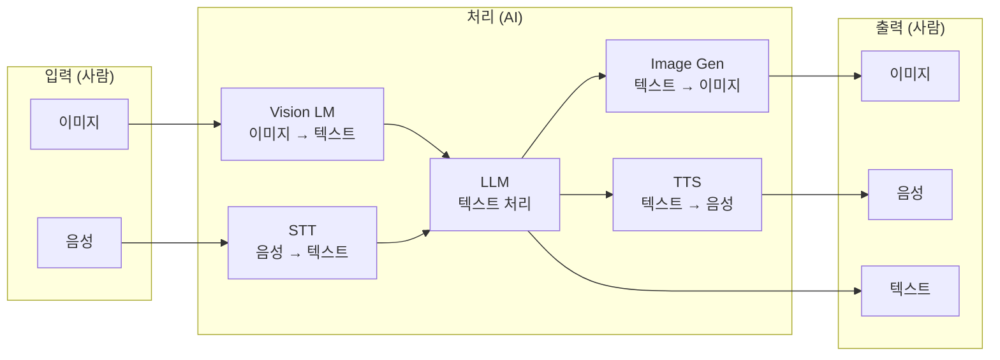
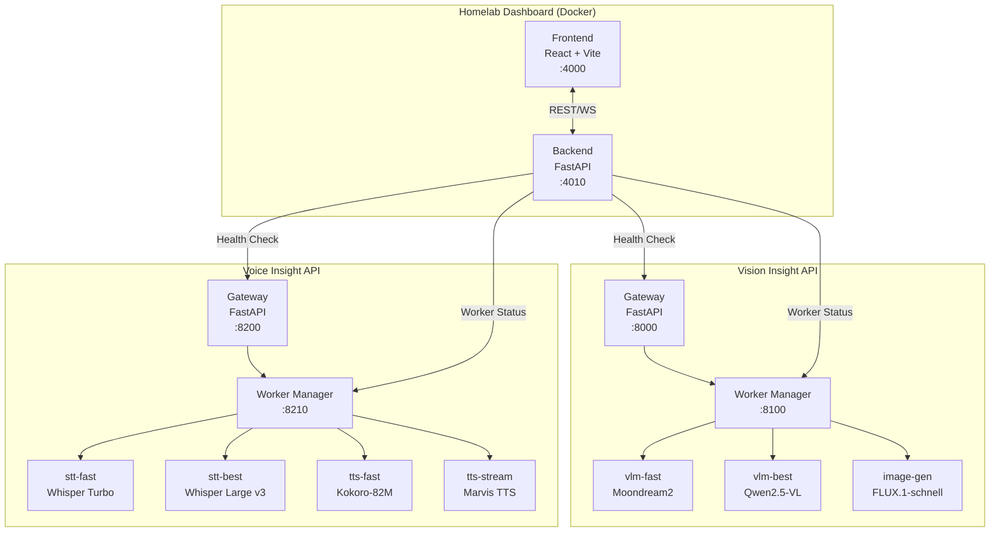

# Vibe Homelab: MLX 기반 AI 서비스와 대시보드 구축기

> 목표: **Vibe Coding 중에 ML 모델을 즉시 활용**할 수 있는 환경을 만들고, **Self-hosted로 완전한 통제권**을 갖기.
> 결과: 이미지 ↔ 텍스트 ↔ 음성 변환이 자유로운 멀티모달 파이프라인과 통합 대시보드.

---

## TLDR;

- **Vibe Coding의 인프라**: 서비스를 빠르게 만들 때 ML 모델을 즉시 활용할 수 있는 환경
- **멀티모달 파이프라인**: 이미지/음성 → 텍스트(LLM 처리) → 이미지/음성으로 변환
- **Vision Insight API**: MLX 가속 이미지 분석(Moondream2, Qwen2.5-VL) + 이미지 생성(FLUX)
- **Voice Insight API**: MLX 가속 음성 인식(Whisper) + 음성 합성(Kokoro, Marvis TTS)
- **Homelab Dashboard**: React + FastAPI로 서비스 상태와 Worker 모니터링
- **Self-hosted**: OpenAI 호환 API로 동작하면서 완전한 데이터 통제권

---

## 배경: Vibe Coding을 위한 AI 인프라

### Vibe Coding이란

요즘 Claude나 Cursor 같은 AI 도구로 코딩하는 방식을 "Vibe Coding"이라고 부르기도 한다. 대략적인 방향만 잡아주면 AI가 코드를 생성하고, 사람은 흐름을 조율하는 방식이다. 이렇게 개발하다 보면 다양한 서비스를 빠르게 프로토타이핑하게 된다.

문제는 텍스트 기반 LLM만으로는 부족할 때가 많다는 것이다:

- 샘플 이미지를 생성해서 UI에 넣고 싶다
- 스크린샷을 분석해서 코드로 변환하고 싶다
- 음성 입력을 받아서 처리하고 싶다
- 결과를 음성으로 읽어주고 싶다

이런 **멀티모달 기능**이 개발 과정에서 바로 필요해질 때, 매번 OpenAI API를 호출하거나 별도 서비스를 찾는 건 번거롭다.

### 멀티모달 파이프라인의 필요성

내가 원하는 건 이런 흐름이었다:



즉, **사람이 이해할 수 있는 형태**(이미지, 음성)를 **기계가 처리할 수 있는 형태**(텍스트)로 바꾸고, LLM으로 처리한 뒤, 다시 **사람이 소비할 수 있는 형태**로 변환하는 것이다.

예를 들어:
- 음성으로 "이 UI 스크린샷 분석해서 개선점 알려줘" → STT → LLM + Vision → TTS로 음성 응답
- "귀여운 로봇 아이콘 만들어줘" → Image Gen → 결과 이미지
- 회의 녹음 → STT → LLM 요약 → TTS로 음성 브리핑

### 왜 Self-hosted인가

[이전 글](/posts/home-lab-iac)에서 Terraform + Ansible로 홈랩 인프라를 코드화한 이야기를 했다. 인프라가 정리되니 자연스럽게 "이 위에서 뭘 돌릴까?"라는 고민이 생겼다.

마침 Mac Mini M4 (32GB)를 새로 구입해서 홈 서버로 사용하게 되었다. Apple Silicon의 MLX 프레임워크가 눈에 들어왔는데, GPU 메모리 제약 없이 통합 메모리를 활용할 수 있어서 생각보다 큰 모델도 로컬에서 돌릴 수 있었다. 24시간 상시 가동해도 전력 소모가 적고, 팬 소음도 거의 없어서 AI 서버로 딱이었다.

OpenAI API를 쓰면 편하지만, Self-hosted를 선택한 이유가 있다:

| 관점 | Cloud API | Self-hosted |
|------|-----------|-------------|
| **비용** | 호출당 과금 (이미지/음성은 비쌈) | 전기세만 (무제한 사용) |
| **프라이버시** | 데이터가 외부 서버로 | 내 데이터는 내 장비 안에 |
| **가용성** | 인터넷 필수, API 장애 영향 | 오프라인 동작, 완전한 통제 |
| **커스터마이징** | 제공되는 모델만 사용 | 원하는 모델 자유롭게 교체 |
| **개발 속도** | API 키 관리, rate limit | 로컬이라 제약 없음 |

특히 Vibe Coding으로 프로토타이핑할 때는 **빠른 실험**이 중요하다. API 비용 걱정 없이 수백 번 호출해보고, 다양한 모델을 바꿔가며 테스트하고 싶었다.

그래서 직접 만들기로 했다.

---

## 아키텍처 개요



핵심 설계 원칙:

| 원칙 | 구현 |
|------|------|
| **On-demand Loading** | Worker는 요청이 들어올 때만 로드, idle 5분 후 자동 offload |
| **Memory Management** | 32GB 통합 메모리를 LRU 기반으로 관리, 필요시 오래된 모델 evict |
| **OpenAI 호환** | `/v1/chat/completions`, `/v1/audio/speech`, `/v1/audio/transcriptions` 엔드포인트 |
| **Gateway-Worker 분리** | Gateway는 항상 떠있고, 무거운 모델은 Worker로 분리 |

---

## Vision Insight API: 이미지 분석과 생성

### 왜 Vision 서비스인가

이미지 관련 AI 기능이 필요한 상황이 의외로 많았다:

- 스크린샷을 Claude에게 보여주고 UI 피드백 받기
- 사진에서 텍스트 추출하기 (OCR)
- 간단한 이미지 생성 (다이어그램, 아이콘 등)

OpenAI Vision API는 비용이 꽤 나가고, 이미지 생성(DALL-E)은 더 비싸다. 로컬에서 돌리면 무제한이다.

### 모델 선택

| Worker | 모델 | 용도 | 메모리 | 특징 |
|--------|------|------|--------|------|
| vlm-fast | Moondream2 | 빠른 이미지 분석 | ~1.5GB | 간단한 질문에 빠른 응답 |
| vlm-best | Qwen2.5-VL-7B-4bit | 고품질 분석 | ~4.5GB | 복잡한 이미지 이해, OCR |
| image-gen | FLUX.1-schnell-4bit | 이미지 생성 | ~6GB | 텍스트→이미지 변환 |

MLX 최적화 덕분에 4bit 양자화 모델도 품질 저하가 거의 없다.

### 사용 예시

```bash
# 이미지 분석 (OpenAI 호환)
curl http://localhost:8000/v1/chat/completions \
  -H "Content-Type: application/json" \
  -d '{
    "model": "vlm-fast",
    "messages": [{
      "role": "user",
      "content": [
        {"type": "text", "text": "이 이미지에 뭐가 있어?"},
        {"type": "image_url", "image_url": {"url": "data:image/png;base64,..."}}
      ]
    }]
  }'

# 이미지 생성
curl http://localhost:8000/v1/images/generations \
  -H "Content-Type: application/json" \
  -d '{
    "model": "image-gen",
    "prompt": "a cute robot coding on a laptop",
    "size": "512x512"
  }'
```

### 구현 포인트: Worker Manager

Worker Manager가 핵심이다. Gateway는 요청만 받고, 실제 모델 로딩과 추론은 Worker가 담당한다.

```python
# Worker Manager의 spawn 로직 (간략화)
async def spawn_worker(alias: str) -> WorkerInfo:
    config = WORKER_CONFIGS[alias]

    # 메모리 확보
    await ensure_memory_available(config.memory_gb)

    # 동적 포트 할당
    port = find_available_port(8001, 8099)

    # subprocess로 Worker 실행
    process = await asyncio.create_subprocess_exec(
        sys.executable, "-m", f"workers.{config.worker_type}",
        "--port", str(port),
        "--model", config.model_name
    )

    # Health check 대기
    await wait_for_health(f"http://localhost:{port}/health")

    return WorkerInfo(alias=alias, port=port, pid=process.pid)
```

Worker는 5분간 idle 상태면 자동으로 offload된다. 메모리가 부족하면 LRU 순서로 evict한다.

---

## Voice Insight API: 음성 인식과 합성

### 왜 Voice 서비스인가

음성 관련 기능도 로컬에서 돌리고 싶었다:

- 회의 녹음 → 텍스트 변환 (프라이버시)
- 긴 문서를 음성으로 듣기 (멀티태스킹)
- 음성 메모 빠르게 정리하기

특히 STT(Speech-to-Text)는 민감한 내용을 외부로 보내고 싶지 않았다.

### 모델 선택

| Worker | 모델 | 용도 | 메모리 | 특징 |
|--------|------|------|--------|------|
| stt-fast | Whisper Large v3 Turbo | 빠른 음성 인식 | ~2GB | 실시간에 가까운 속도 |
| stt-best | Whisper Large v3 | 고품질 음성 인식 | ~3GB | 더 정확한 인식 |
| tts-fast | Kokoro-82M | 빠른 음성 합성 | ~0.5GB | 자연스러운 음성 |
| tts-stream | Marvis TTS 250M | 스트리밍 TTS | ~1GB | 실시간 스트리밍 지원 |

### 사용 예시

```bash
# 음성 인식 (OpenAI 호환)
curl http://localhost:8200/v1/audio/transcriptions \
  -F file=@meeting.mp3 \
  -F model=stt-fast

# 음성 합성
curl http://localhost:8200/v1/audio/speech \
  -H "Content-Type: application/json" \
  -d '{
    "model": "tts-fast",
    "input": "안녕하세요, 오늘 날씨가 좋네요.",
    "voice": "af_heart"
  }' \
  --output speech.mp3
```

### 스트리밍 TTS

긴 텍스트를 음성으로 변환할 때 전체가 생성될 때까지 기다리면 UX가 안 좋다. Marvis TTS로 스트리밍을 구현했다:

```python
@app.post("/v1/audio/speech")
async def create_speech(request: SpeechRequest):
    if request.stream:
        return StreamingResponse(
            generate_audio_chunks(request.input),
            media_type="audio/mpeg"
        )
    else:
        audio = await generate_full_audio(request.input)
        return Response(content=audio, media_type="audio/mpeg")
```

---

## Homelab Dashboard: 통합 모니터링


### 왜 대시보드인가

Vision API와 Voice API를 만들고 나니, 상태를 확인하려면 매번 curl로 health check를 해야 했다. 귀찮았다.

- Gateway가 살아있는지
- 어떤 Worker가 로드되어 있는지
- 메모리를 얼마나 쓰고 있는지

이걸 한눈에 보고 싶었다.

### 기술 스택

| 레이어 | 기술 | 이유 |
|--------|------|------|
| Frontend | React + Vite + Tailwind | 빠른 개발, 반응형 UI |
| Backend | FastAPI | 비동기 처리, OpenAPI 문서 자동 생성 |
| 배포 | Docker Compose | 간단한 배포, 서비스 의존성 관리 |

### 주요 기능

1. **Service Health**: 각 API의 Gateway 상태 (healthy/unhealthy)
2. **Worker Status**: 현재 로드된 Worker, 메모리 사용량, idle 시간
3. **Real-time Updates**: WebSocket으로 상태 변화 즉시 반영
4. **Worker Control**: 대시보드에서 Worker 시작/중지 (TODO)

### Docker 연동 팁

Dashboard는 Docker 컨테이너로 돌고, Vision/Voice API는 호스트에서 돈다. 컨테이너에서 호스트 서비스에 접근하려면 `host.docker.internal`을 사용해야 한다:

```yaml
# backend/config.yaml
services:
  vision-insight:
    gateway:
      host: "host.docker.internal"  # localhost가 아님!
      port: 8000
    worker_manager:
      host: "host.docker.internal"
      port: 8100
```

이걸 몰라서 처음에 "Connection refused" 에러와 한참 싸웠다.

### 대시보드 화면 설명

위 스크린샷에서 볼 수 있듯이:

- **상단 요약**: Services(2개), Workers Running(0/7), Worker Managers(1/2), System Memory
- **Vision Insight API**: Healthy 상태, Gateway 응답 7ms
- **Voice Insight API**: Unhealthy (현재 서비스 중지 상태)
- **Worker 목록**: 각 Worker별 상태와 Start 버튼

Worker가 on-demand로 로드되기 때문에, 처음에는 "Stopped" 상태로 보인다. 요청이 들어오면 자동으로 "Running"으로 바뀌고, idle 타이머가 표시된다.

---

## 서비스 포트 정리

최종적으로 이렇게 포트를 정리했다:

| 포트 | 서비스 | 설명 |
|------|--------|------|
| 4000 | Dashboard Frontend | React UI |
| 4010 | Dashboard Backend | FastAPI |
| 8000 | Vision Gateway | OpenAI 호환 Vision API |
| 8100 | Vision Worker Manager | Worker 생명주기 관리 |
| 8001-8003 | Vision Workers | VLM, Image-gen |
| 8200 | Voice Gateway | OpenAI 호환 Audio API |
| 8210 | Voice Worker Manager | Worker 생명주기 관리 |
| 8211+ | Voice Workers | STT, TTS |

`~/.agents/SERVICES.md`에 이 정보를 기록해두고 Service Manager 스킬로 관리한다.

---

## 배운 점

### 1. MLX의 가능성

Apple Silicon에서 MLX는 정말 인상적이다. PyTorch보다 메모리 효율이 좋고, 4bit 양자화도 쉽게 적용된다. Mac Mini M4 32GB로도 VLM, 이미지 생성, STT, TTS를 동시에 서빙할 수 있다.

### 2. On-demand의 중요성

처음에는 모든 Worker를 항상 띄워두려고 했다. 메모리가 금방 바닥났다. On-demand 로딩으로 바꾸니 필요할 때만 메모리를 쓰고, idle 시 자동 정리돼서 훨씬 효율적이다.

### 3. OpenAI 호환의 편리함

API를 OpenAI 호환으로 만들어두니, 기존에 OpenAI를 쓰던 코드에서 base_url만 바꾸면 바로 동작한다. 에코시스템의 힘이 크다.

### 4. Docker와 호스트 통신

컨테이너에서 호스트 서비스에 접근할 때 `localhost`가 안 된다는 걸 처음 알았다. `host.docker.internal`을 쓰거나, 네트워크 설정을 바꿔야 한다. 기본적인 것 같지만 처음 겪으면 헤맬 수 있다.

---

## 실제 활용 시나리오

이 인프라로 어떤 걸 할 수 있는지 몇 가지 예시:

### 1. 이미지 기반 코드 생성

스크린샷을 찍어서 Vision API로 분석하고, Claude에게 "이 UI를 React로 만들어줘"라고 하면 바로 코드가 나온다. OpenAI Vision을 쓰면 매번 비용이 드는데, 로컬이라 부담 없이 수십 번 반복할 수 있다.

### 2. 음성 메모 정리 자동화

회의 녹음 → STT → LLM 요약 → TTS 브리핑. 이 파이프라인을 iOS Shortcuts로 자동화하면, 녹음 버튼 하나로 정리된 요약을 음성으로 들을 수 있다.

### 3. 프로토타입 에셋 생성

새 프로젝트를 시작할 때 샘플 이미지가 필요하면 Image Gen으로 즉시 생성. 아이콘, 배경, 캐릭터 등을 빠르게 만들어서 프로토타입에 넣을 수 있다.

---

## 앞으로 할 것

- [ ] Dashboard에서 Worker 시작/중지 버튼 추가
- [ ] Worker별 메트릭 그래프 (응답 시간, 처리량)
- [ ] Prometheus exporter 추가해서 Grafana 연동
- [ ] iOS Shortcuts로 음성 메모 → STT → 정리 자동화
- [ ] 더 많은 모델 지원 (LLaMA, Gemma 등)
- [ ] MCP(Model Context Protocol) 서버로 Claude Desktop과 연동

---

## 맺음말

이 프로젝트의 핵심은 **Vibe Coding의 인프라**를 만드는 것이었다. 새로운 서비스를 빠르게 프로토타이핑할 때, 이미지 생성이 필요하면 바로 Image Gen을, 음성 처리가 필요하면 바로 STT/TTS를 호출할 수 있다. API 비용 걱정 없이, 프라이버시 걱정 없이.

Self-hosted의 가장 큰 장점은 **완전한 통제권**이다:
- 내 데이터는 내 장비 안에서만 처리된다
- 원하는 모델을 자유롭게 바꿔가며 실험할 수 있다
- 비용은 전기세뿐, 무제한으로 사용할 수 있다

물론 클라우드 API보다 번거로운 점도 있다. 모델 업데이트를 직접 해야 하고, 메모리 관리에 신경 써야 한다. 하지만 홈랩을 운영하면서 이런 삽질을 즐기는 사람이라면, 충분히 가치 있는 프로젝트라고 생각한다.

[Home Lab IaC](/posts/home-lab-iac)에서 인프라를 정리하고, 그 위에 실제로 서비스를 만들어 배포하니 뿌듯하다. "서비스를 만들어서 배포하면 되겠다"던 그 마무리를 드디어 했다.

이제 진짜로, 신나게 서비스를 만들어볼 차례다.

## 관련 글

- [Home Dev Environment](/posts/home-dev)
- [Home Lab IaC](/posts/home-lab-iac)
- [Claude Code Agent Skills](/posts/claude-code-agent-skills)

---

## 참고

- [MLX Documentation](https://ml-explore.github.io/mlx/)
- [MLX Community Models (Hugging Face)](https://huggingface.co/mlx-community)
- [Moondream2](https://huggingface.co/vikhyatk/moondream2)
- [Qwen2.5-VL](https://huggingface.co/Qwen/Qwen2.5-VL-7B-Instruct)
- [FLUX.1-schnell](https://huggingface.co/black-forest-labs/FLUX.1-schnell)
- [Whisper Large v3](https://huggingface.co/openai/whisper-large-v3)
- [Kokoro TTS](https://huggingface.co/hexgrad/Kokoro-82M)
- [FastAPI](https://fastapi.tiangolo.com/)
- [Docker host.docker.internal](https://docs.docker.com/desktop/networking/#i-want-to-connect-from-a-container-to-a-service-on-the-host)
