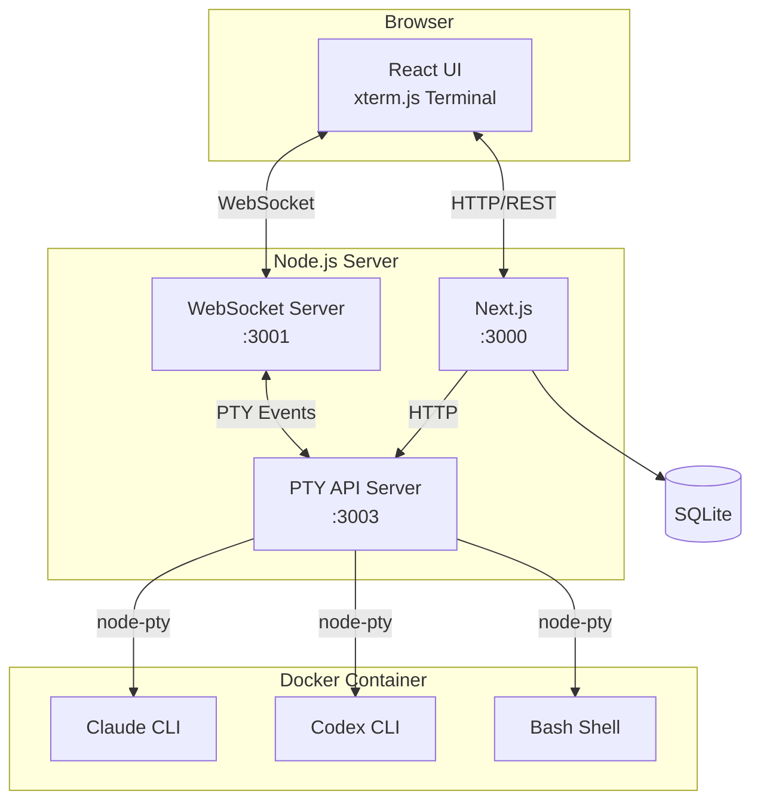

# Claude Code Cloud: AI 코딩 세션을 브라우저에서

> 목표: **"아무 환경에서나 Claude Code에 접속해서 작업하기"**를 현실로 만들기.
> 결과: 터미널 미러링, 세션 관리, 파일 탐색기, 실시간 협업까지 갖춘 웹 서비스 완성.

---

## 배경: 왜 이걸 만들었나

Claude Code CLI가 공개되고 나서부터 거의 모든 개발 작업에 Claude를 활용하게 되었다. 문제는 환경이 달라질 때였다. 데스크톱에서 시작한 작업을 랩톱에서 이어가려면 상태가 공유되지 않고, iPad에서는 아예 CLI를 실행할 수 없었다.

"Claude Code가 웹에서 돌아가면 어떨까?"라는 생각이 들었다. 브라우저만 있으면 어디서든 접속해서 AI와 코딩할 수 있으면 좋겠다고 생각했다. 마침 [Home Lab](/posts/home-lab-iac)에 Kubernetes 환경도 갖춰져 있으니, 직접 만들어보기로 했다.

LLM의 도움 없이는 이 프로젝트를 일주일 만에 완성하지 못했을 것이다. 특히 node-pty와 WebSocket 연동, Docker 멀티스테이지 빌드 같은 부분은 Claude와 대화하면서 빠르게 해결할 수 있었다.

---

## 핵심 기능

| 기능                        | 설명                                                      |
| --------------------------- | --------------------------------------------------------- |
| **Terminal Mirroring**      | Claude Code CLI 출력을 WebSocket으로 실시간 전송          |
| **Session Management**      | 세션 생성, 시작, 중지, 삭제를 SQLite로 영구 저장          |
| **File Explorer**           | 프로젝트 파일을 트리 형태로 탐색하고 구문 강조로 미리보기 |
| **Real-time Collaboration** | 토큰 기반 링크로 세션 공유, 참여자 실시간 확인            |
| **Multi-Terminal**          | Claude, Codex, Shell 탭을 동시에 사용                     |

---

## 스크린샷

### 대시보드

로그인 후 보이는 메인 화면. 세션 목록과 워크스페이스를 관리할 수 있다.


### 터미널

세션을 시작하면 Claude Code CLI가 브라우저에서 실행된다. 로컬 터미널과 동일한 경험을 제공한다.


### 파일 탐색기

워크스페이스 파일을 트리 형태로 탐색하고, 코드를 미리볼 수 있다.


---

## 아키텍처 설계



### 왜 이런 구조인가

처음에는 Next.js 하나로 모든 것을 처리하려 했다. 그런데 node-pty는 서버 사이드에서만 동작하고, WebSocket 연결도 별도로 관리해야 해서 자연스럽게 분리되었다.

- **Next.js (3000)**: REST API와 프론트엔드 서빙
- **WebSocket Server (3001)**: 터미널 실시간 통신. xterm.js와 연결
- **PTY API Server (3003)**: node-pty로 CLI 프로세스 관리

세 서버가 분리되어 있지만, Docker 컨테이너 안에서 `concurrently`로 함께 실행된다. 개발할 때는 각각 독립적으로 재시작할 수 있어서 편리했다.

---

## 핵심 구현

### Terminal Mirroring

가장 중요한 기능은 CLI 출력을 브라우저에 실시간으로 보여주는 것이었다. node-pty로 pseudo-terminal을 생성하고, 출력을 WebSocket으로 클라이언트에 전송한다.

```typescript
// PtyManager.ts - 핵심 로직
const pty = spawn("claude", [], {
  name: "xterm-256color",
  cols: 120,
  rows: 30,
  cwd: workDir,
  env: {
    ...process.env,
    ANTHROPIC_API_KEY: apiKey,
    TERM: "xterm-256color",
  },
});

pty.onData((data) => {
  // WebSocket을 통해 모든 연결된 클라이언트에 브로드캐스트
  wsServer.broadcast("terminal:output", { sessionId, data });
});
```

클라이언트에서는 xterm.js로 터미널을 렌더링한다. xterm.js가 ANSI 이스케이프 시퀀스를 해석해서 색상과 커서 위치까지 정확하게 재현한다.

### Session Persistence

세션 상태를 SQLite에 저장해서 서버가 재시작되어도 유지된다. 세션마다 워크스페이스를 연결하고, 상태 머신으로 생명주기를 관리한다.

```
idle → starting → running → stopping → idle
                     ↓
                   error
```

### File Explorer

워크스페이스 파일을 트리 형태로 보여주고, Monaco Editor로 코드를 미리볼 수 있다. Claude가 파일을 수정하면 실시간으로 반영된다.

### Docker 멀티스테이지 빌드

Claude CLI와 Codex CLI를 컨테이너에 포함시키기 위해 멀티스테이지 빌드를 사용했다.

```dockerfile
# Stage 1: Claude CLI 설치
FROM node:20 AS claude-cli
RUN npm install -g @anthropic-ai/claude-code

# Stage 2: Codex CLI 설치
FROM node:20 AS codex-cli
RUN npm install -g @openai/codex

# Stage 3: 런타임
FROM node:20-slim AS runner
COPY --from=claude-cli /usr/local/bin/claude /usr/local/bin/claude
COPY --from=codex-cli /usr/local/bin/codex /usr/local/bin/codex
```

이렇게 하면 최종 이미지에는 필요한 바이너리만 포함되어서 크기를 줄일 수 있었다.

---

## Claude와 함께한 개발 과정

이 프로젝트 자체가 Claude Code로 개발되었다. 세션 기록을 보면 어떤 대화를 했는지 알 수 있는데, 몇 가지 흥미로운 순간이 있었다.

### Codex 인증 문제 해결

Codex CLI는 localhost로 OAuth 콜백을 받는데, Docker 컨테이너 안에서는 브라우저를 실행할 수 없어서 인증이 불가능했다. Claude에게 이 문제를 설명하니, 환경변수로 API 키를 직접 주입하는 방식과 호스트에서 미리 인증한 설정을 마운트하는 두 가지 해결책을 제시했다.

### 스킬 관리 시스템 설계

처음에는 스킬을 어떻게 관리할지 막막했다. Claude와 대화하면서 사용자별 스킬 디렉토리 분리, 데이터베이스 스키마, API 엔드포인트까지 구체화할 수 있었다.

```
~/.claude/skills/
├── user-a/
│   ├── git-commit-pr/
│   └── code-review/
└── user-b/
    └── custom-skill/
```

### 실시간 디버깅

WebSocket 연결이 끊기는 문제가 있었는데, Claude가 heartbeat 메커니즘과 재연결 로직을 제안해줬다. 코드를 직접 작성해주기도 하고, 왜 이런 접근이 필요한지 설명해주기도 했다.

---

## GitOps로 배포

[이전 글](/posts/home-lab-iac)에서 구축한 GitOps 파이프라인으로 배포했다. GitHub에 푸시하면 Gitea Actions가 이미지를 빌드하고, ArgoCD가 Kubernetes에 배포한다.

```yaml
# ArgoCD Application
apiVersion: argoproj.io/v1alpha1
kind: Application
metadata:
  name: claude-code-cloud
spec:
  source:
    repoURL: https://github.com/jiunbae/IaC.git
    path: kubernetes/apps/claude-code-cloud
  destination:
    server: https://kubernetes.default.svc
  syncPolicy:
    automated:
      prune: true
      selfHeal: true
```

코드를 푸시하면 자동으로 배포되니, 개발-배포 사이클이 빠르다. 버그를 고치고 푸시하면 몇 분 후에 프로덕션에 반영된다.

---

## 실제로 써보니

### 좋았던 점

1. **환경 독립성**: 어떤 기기에서든 브라우저만 있으면 Claude Code를 사용할 수 있다
2. **세션 지속성**: 노트북을 덮어도 세션이 유지된다. 다음 날 이어서 작업 가능
3. **협업**: 세션을 공유해서 다른 사람에게 보여줄 수 있다
4. **파일 탐색**: Claude가 수정한 파일을 실시간으로 확인할 수 있다

### 아쉬운 점

1. **입력 지연**: WebSocket을 거치다 보니 로컬 터미널보다 약간 느리다
2. **리소스**: 각 세션마다 CLI 프로세스가 떠서 메모리를 많이 사용한다
3. **오프라인 불가**: 당연히 인터넷 연결이 필요하다

### 개선하고 싶은 것

- 세션별 컨텍스트 저장 및 복원
- 여러 사용자가 동시에 같은 세션에서 작업하는 진짜 협업 모드
- Claude/Codex 외에 다른 AI 모델 지원

---

## 맺음말

Claude Code Cloud를 만들면서 AI와 함께 개발하는 경험이 한층 더 깊어졌다. 단순히 AI를 도구로 쓰는 것을 넘어서, AI와 함께 AI를 위한 도구를 만드는 메타적인 경험이었다.

특히 세션 기록을 통해 개발 과정을 되돌아볼 수 있다는 점이 흥미로웠다. 어떤 문제에 부딪혔고, 어떤 해결책을 시도했는지가 모두 기록되어 있으니 나중에 비슷한 문제를 만나면 참고할 수 있다.

이 프로젝트는 [GitHub](https://github.com/jiunbae/claude-code-cloud)에 공개되어 있고, 직접 배포해서 사용할 수 있다. Docker Compose로 간단하게 띄울 수 있으니, 관심 있으면 한번 시도해보길 바란다.

## 관련 글

- [Home Dev Environment](/posts/home-dev)
- [Home Lab IaC](/posts/home-lab-iac)

---

## 참고

- [Claude Code Cloud GitHub](https://github.com/jiunbae/claude-code-cloud)
- [Claude Code CLI](https://docs.anthropic.com/en/docs/claude-code/overview)
- [xterm.js](https://xtermjs.org/)
- [node-pty](https://github.com/microsoft/node-pty)
- [Home Lab IaC](/posts/home-lab-iac)
