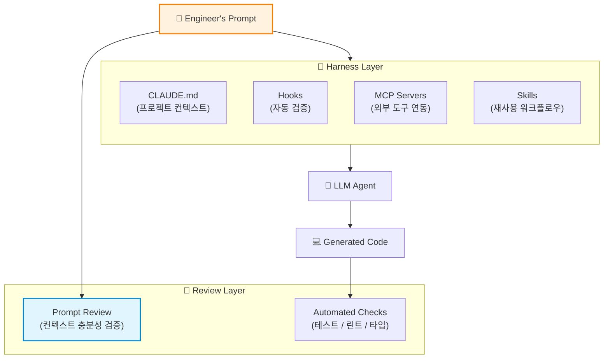
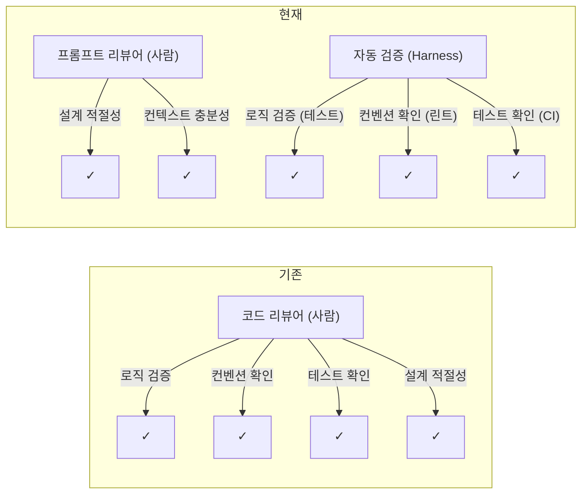

## 당신의 팀은 아직 코드를 리뷰하고 있나요?

두 엔지니어가 같은 기능을 구현한다고 상상해보자.

**엔지니어 A**는 Claude Code에게 이렇게 말한다.

```
결제 API 만들어줘
```

**엔지니어 B**는 이렇게 말한다.

```
PG사 연동 결제 API를 구현해야 합니다.

## 컨텍스트
- 현재 결제 시스템은 src/payments/ 아래에 있고, PaymentGateway 인터페이스를 따릅니다
- 기존에 Toss Payments 연동이 되어 있으며, 이번에 NHN KCP를 추가합니다
- 에러 처리는 공통 에러 핸들러(src/common/error-handler.ts)를 사용합니다

## 요구사항
- 결제 승인, 취소, 부분취소를 지원해야 합니다
- 멱등성 키를 필수로 받아야 합니다
- 결제 상태는 PENDING → APPROVED → SETTLED 순서로 전이됩니다
- 실패 시 최대 3회 재시도하되, exponential backoff를 적용합니다

## 제약사항
- 응답 시간 p99 < 500ms
- PG사 장애 시 fallback 없이 즉시 실패 반환 (보상 트랜잭션으로 처리)
```

A의 결과물은 리뷰에서 수십 개의 코멘트가 달린다. 에러 처리가 없고, 프로젝트 컨벤션을 따르지 않으며, 기존 인터페이스와 호환되지 않는다. B의 결과물은 큰 수정 없이 머지된다.

둘 다 같은 LLM을 썼다. 차이는 **코드가 아니라 프롬프트**에 있었다.

이 글은 여기서 출발한다. **LLM Agent의 성능이 이미 충분하다면, 우리가 진짜 리뷰해야 할 것은 코드가 아니라 프롬프트가 아닐까?**


## 전제: LLM은 이미 충분히 잘 코딩한다

우리 팀이 프롬프트 리뷰로 전환할 수 있었던 근거는 단순하다.

> 명세가 구체적이고, 지시가 명확하며, 컨텍스트가 충분히 제공된다면 — LLM Agent는 사람만큼 잘 코딩할 수 있다.

이건 희망적 관측이 아니라 반복적으로 관찰한 결과다. Claude Code, Cursor, Copilot 같은 도구들의 코드 품질은 **입력의 품질에 정비례**한다. 같은 모델이라도 프롬프트가 다르면 출력이 극적으로 달라진다.

그렇다면 문제는 명확해진다.

| 기존 패러다임 | 새로운 패러다임 |
|-------------|--------------|
| 사람이 코드를 짜고, 사람이 코드를 리뷰한다 | 사람이 프롬프트를 짜고, Agent가 코드를 짜고, 사람이 **프롬프트**를 리뷰한다 |
| 리뷰 대상: 구현의 정확성 | 리뷰 대상: 명세의 충분성 |
| "이 코드가 올바른가?" | "이 프롬프트가 올바른 코드를 만들어낼 수 있는가?" |

코드 리뷰가 사라지는 것은 아니다. 자동화된 검증(테스트, 린트, 타입 체크)이 코드 품질의 마지노선을 담당한다. 프롬프트 리뷰는 그 **이전 단계** — 올바른 코드가 생성될 조건 자체를 검증한다.


## Harness: 프롬프트 리뷰가 가능한 환경 만들기

프롬프트 리뷰가 동작하려면 전제 조건이 있다. 프롬프트만으로 충분한 코드가 나와야 한다. 이를 위해 우리는 **Harness** — LLM Agent가 일관되게 높은 품질의 결과물을 내도록 돕는 구조화된 환경을 구축했다.



Harness의 핵심은 **Agent가 매번 일관된 컨텍스트를 갖도록** 환경을 정비하는 것이다.

### CLAUDE.md: 실행 가능한 프로젝트 지식

`CLAUDE.md`는 단순한 문서가 아니다. Agent가 매 세션 시작 시 읽는 **실행 가능한 프로젝트 명세**다.

```markdown
# Architecture
- 모놀리식 NestJS 백엔드, /src/modules/ 아래 도메인별 분리
- 모든 API는 /src/common/decorators/api-response.decorator.ts의 표준 응답 포맷을 따름

# Conventions
- 서비스 메서드는 반드시 트랜잭션 데코레이터를 사용할 것
- DTO는 class-validator를 사용하고, 모든 필드에 @ApiProperty()를 붙일 것

# Testing
- 단위 테스트는 jest, E2E는 supertest
- 테스트 파일은 __tests__/ 디렉토리에 {name}.spec.ts 형식으로
```

이 파일이 잘 관리되어 있으면, 엔지니어는 프롬프트에서 프로젝트 컨텍스트를 반복할 필요가 없다. "결제 모듈에 KCP 연동을 추가해줘"라는 짧은 프롬프트만으로도 Agent는 프로젝트 구조, 컨벤션, 테스트 전략을 이미 알고 있다.

### Hooks: 자동화된 품질 게이트

사람이 매번 확인하지 않아도 되는 것들은 자동화한다.

```json
{
  "hooks": {
    "PostToolUse": [
      {
        "matcher": "Write|Edit",
        "command": "npm run lint:fix -- $FILE_PATH && npm run typecheck"
      }
    ],
    "PostCommit": [
      {
        "command": "npm run test:affected"
      }
    ]
  }
}
```

Agent가 파일을 수정할 때마다 린트와 타입 체크가 자동으로 돌고, 커밋 시 영향받는 테스트가 실행된다. 이 자동화 레이어가 있기 때문에 프롬프트 리뷰에서 "테스트 짰어?", "린트 통과해?" 같은 확인을 하지 않아도 된다.


## 프롬프트 리뷰: 무엇을 보는가

코드 리뷰에서 "이 변수명이 적절한가", "이 로직에 off-by-one 에러가 없는가"를 보듯이, 프롬프트 리뷰에도 체크리스트가 있다.

### 1. 컨텍스트 충분성 (Context Sufficiency)

가장 중요한 항목이다. Agent가 올바른 결과를 내기 위해 필요한 정보가 프롬프트에 충분히 담겨 있는가?

```
❌ Bad: "사용자 목록 API를 만들어줘"
✅ Good: "GET /api/v2/users 엔드포인트를 만들어줘.
    - 기존 v1 API(src/modules/user/user.controller.ts)를 참고
    - cursor 기반 페이지네이션 적용 (기존 PaginationDto 사용)
    - 응답에 lastLoginAt 필드 추가 (User 엔티티에 이미 있음)
    - 관리자만 접근 가능 (@Roles 데코레이터 사용)"
```

**체크 포인트:**
- 관련 파일/모듈의 위치를 명시했는가?
- 기존 패턴이나 인터페이스를 참조했는가?
- 비즈니스 로직의 엣지 케이스를 언급했는가?
- 비기능 요구사항(성능, 보안)을 포함했는가?

### 2. 명세의 명확성 (Specification Clarity)

모호한 표현이 없는가? Agent가 "알아서 판단"해야 하는 부분이 최소화되어 있는가?

```
❌ "적절한 에러 처리를 해줘"
✅ "PG사 타임아웃(5초) 시 PaymentTimeoutException을 throw하고,
    네트워크 에러 시 최대 3회 재시도 후 PaymentNetworkException을 throw해줘.
    두 경우 모두 결제 상태를 FAILED로 업데이트해야 해."
```

"적절한"이라는 단어가 프롬프트에 등장하면 경고 신호다. 그것은 판단을 Agent에게 위임한다는 뜻이고, Agent의 판단이 팀의 기준과 다를 수 있다.

### 3. 범위의 적절성 (Scope Appropriateness)

하나의 프롬프트가 너무 많은 것을 요구하고 있지 않은가?

```
❌ "결제 시스템을 전면 리팩토링하고 새 PG사를 연동해줘"
✅ 프롬프트 1: "PaymentGateway 인터페이스를 v2로 마이그레이션해줘 (cancel에 부분취소 파라미터 추가)"
✅ 프롬프트 2: "KcpPaymentGateway 클래스를 PaymentGateway v2 인터페이스로 구현해줘"
✅ 프롬프트 3: "결제 모듈의 기존 테스트를 v2 인터페이스에 맞게 업데이트해줘"
```

사람도 PR이 너무 크면 리뷰 품질이 떨어진다. Agent도 마찬가지다. 프롬프트의 범위가 곧 변경의 범위를 결정한다.


## 코드 리뷰는 어디로 갔는가

프롬프트 리뷰가 코드 리뷰를 **완전히** 대체한다고 말하는 것은 아니다. 더 정확히는, 코드 리뷰의 역할이 재분배된다.



사람이 하던 반복적 검증 — 컨벤션, 린트, 테스트 커버리지 — 은 Harness의 자동화 레이어가 담당한다. 사람은 **더 높은 수준의 판단**에 집중한다. "이 기능이 이 구조로 만들어지는 것이 맞는가?", "이 프롬프트가 우리의 의도를 정확히 전달하고 있는가?"

이것은 코드 리뷰의 폐지가 아니라 **승격**이다.


## 프롬프트 리뷰의 실제 워크플로우

실제로 우리 팀에서 프롬프트 리뷰가 어떻게 이루어지는지 구체적으로 보자.

### Step 1: 프롬프트 작성

엔지니어가 구현할 기능에 대한 프롬프트를 작성한다. 이 프롬프트는 코드와 함께 버전 관리된다.

```
contents/prompts/payment-kcp-integration.md
```

### Step 2: 프롬프트 리뷰 (PR)

팀원이 프롬프트를 리뷰한다. 이때의 질문은:

- "PG사별 webhook 포맷이 다른데, 이 부분의 명세가 빠져 있지 않나요?"
- "부분취소 시 기존 결제 금액 업데이트 로직이 명시되어 있지 않습니다"
- "에러 상황에서 사용자에게 보여줄 메시지 정책이 필요합니다"

리뷰 코멘트의 성격이 달라진다. "이 변수명을 바꿔주세요"가 아니라 **"이 시나리오에 대한 명세가 빠져 있습니다"**가 된다.

### Step 3: Agent 실행 및 자동 검증

프롬프트가 승인되면, Agent가 코드를 생성하고 Harness의 자동 검증을 통과한다. 테스트 실패나 타입 에러가 있으면 Agent가 스스로 수정한다.

### Step 4: 최종 확인

생성된 코드는 간략한 최종 확인을 거친다. 하지만 이 단계에서 발견되는 이슈는 거의 없다. 프롬프트가 충분했고 자동 검증을 통과했기 때문이다.


## 이 방식이 가져온 변화

### 리뷰 시간의 변화

프롬프트 리뷰는 코드 리뷰보다 빠르다. 500줄의 코드 diff를 한 줄 한 줄 읽는 것보다, 30줄의 프롬프트에서 빠진 컨텍스트를 찾는 것이 인지적으로 훨씬 가볍다.

| | 코드 리뷰 | 프롬프트 리뷰 |
|---|----------|-------------|
| 리뷰 대상 분량 | 수백 줄 코드 diff | 수십 줄 프롬프트 |
| 필요한 컨텍스트 | 전체 코드베이스 이해 | 비즈니스 요구사항 이해 |
| 리뷰어의 멘탈 모델 | "이 구현이 정확한가" | "이 명세가 충분한가" |
| 주요 피드백 | 구현 수정 요청 | 명세 보완 요청 |

### 신규 팀원 온보딩

새로 합류한 엔지니어에게 "이 프로젝트의 코드를 이해하세요"라고 하는 대신, "이 프로젝트의 CLAUDE.md를 읽고, 기존 프롬프트들을 참고해서 작성해보세요"라고 안내한다.

좋은 프롬프트의 예시가 쌓이면, 그것 자체가 **실행 가능한 문서**가 된다. "결제 모듈은 이런 수준의 명세가 필요하다"는 것을 프롬프트 히스토리가 보여준다.

### 설계 논의의 전진 배치

기존에는 설계 리뷰와 코드 리뷰가 분리되어 있었다. 설계 문서를 리뷰하고, 한참 뒤에 구현된 코드를 다시 리뷰했다. 프롬프트 리뷰에서는 이 두 단계가 하나로 합쳐진다. 프롬프트 자체가 설계 문서이자 구현 지시서이기 때문이다.


## 한계와 열린 질문들

솔직하게 말하면, 이 방식이 모든 상황에서 동작하는 것은 아니다.

**프롬프트로 표현하기 어려운 것들이 있다.** 복잡한 알고리즘의 최적화, 미묘한 동시성 이슈, 기존 코드와의 미세한 상호작용 같은 것들은 프롬프트만으로 충분한 컨텍스트를 전달하기 어렵다. 이런 경우에는 여전히 사람이 직접 코드를 작성하고 전통적인 코드 리뷰를 진행한다.

**프롬프트 리뷰 역량은 별도로 길러야 한다.** 좋은 코드 리뷰어가 자동으로 좋은 프롬프트 리뷰어가 되지는 않는다. "이 프롬프트에 어떤 컨텍스트가 빠져 있는가"를 판단하려면, 코드 구현 능력과는 다른 종류의 전문성이 필요하다.

**정량적 효과 측정이 어렵다.** "프롬프트 리뷰를 도입해서 생산성이 X% 올랐다"고 말하기는 쉽지 않다. 다만, 리뷰 사이클이 줄고 코드 리뷰에서의 반려율이 낮아진 것은 체감하고 있다.


## 나가며

Software 3.0 시대에 엔지니어의 가치는 "코드를 잘 짜는 것"에서 "올바른 코드가 만들어질 조건을 설계하는 것"으로 이동하고 있다. 프롬프트 리뷰는 그 이동을 반영하는 실천이다.

우리가 코드 리뷰를 통해 지켜온 것 — 코드 품질, 일관성, 안정성 — 은 여전히 중요하다. 다만 그것을 지키는 방법이 달라졌을 뿐이다. Agent가 코드를 짜는 시대에, 사람은 **Agent가 올바르게 동작할 조건**을 설계하고 검증하는 데 집중해야 한다.

프롬프트가 곧 설계이고, 프롬프트 리뷰가 곧 설계 리뷰다.

도구는 이미 충분히 좋다. 이제 남은 질문은 하나다. **우리는 그 도구에게 충분히 좋은 지시를 내리고 있는가?**
