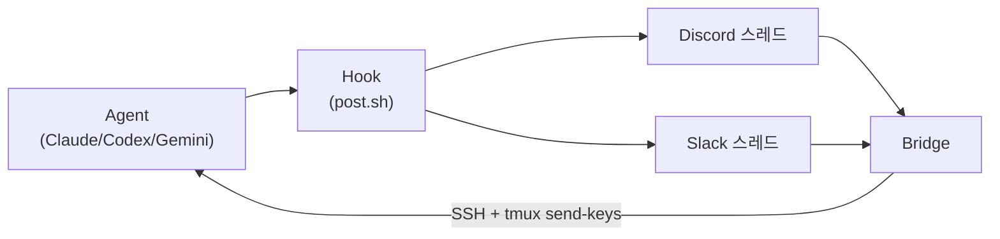
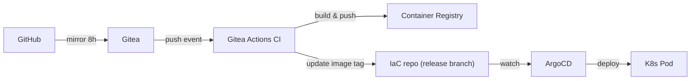

# aily: AI 에이전트 세션을 폰에서 관리하기까지

## 문제: "끝났나?"

AI 코딩 에이전트를 쓰다 보면, 자연스럽게 이런 워크플로우가 됩니다:

1. tmux 세션에서 Claude Code에 작업을 시킴
2. 시간이 걸리니까 자리를 비움
3. 돌아와서 터미널을 확인

문제는 3번입니다. 에이전트가 5분 전에 끝났을 수도 있고, 질문을 하고 기다리고 있을 수도 있습니다. SSH 호스트가 여러 대이고 세션이 동시에 돌아가면, **어떤 세션이 끝났는지 알 방법이 없습니다**.

> "그냥 Discord에 알림 하나 오면 안 되나?"

이 한 줄짜리 생각이 aily의 시작이었습니다.

## 금요일 밤: 5개 파일, 297줄

2월 7일 금요일 밤, 첫 커밋에는 파일이 5개뿐이었습니다.

```
hooks/
├── notify-clawdia.sh       # Claude Code 알림 훅
└── extract-last-message.py  # JSONL 파서
install.sh
.env.example
.gitignore
```

핵심 로직은 단순했습니다:

```bash
# Claude Code의 Notification 훅이 실행되면:
# 1. 5초 대기 (JSONL 파일에 응답이 쓰일 때까지)
# 2. extract-last-message.py로 마지막 어시스턴트 메시지 추출
# 3. Discord 스레드에 포스트
(
  sleep 5
  message=$(python3 extract-last-message.py)
  curl -X POST "discord.com/api/.../messages" -d "$message"
) &
disown
exit 0  # 훅은 즉시 리턴 (Claude Code 타임아웃 방지)
```

스레드 이름은 `[agent] <tmux 세션명>`. 세션마다 전용 스레드가 생기고, 에이전트의 응답이 거기에 올라옵니다.

"Clawdia"라는 이름은 Claude의 별명이었습니다 — 아직 이 도구가 Claude 전용이라고 생각했거든요.

## 첫 번째 전환점: AI 봇 → 결정론적 브릿지

원래 계획은 **Discord 봇이 AI로 메시지를 이해하고 전달**하는 것이었습니다. Clawdia 봇이 스레드의 메시지를 읽고, AI가 판단해서 tmux로 포워딩하는 구조.

하루 만에 포기했습니다.

AI가 중간에 끼면 **100% 신뢰할 수 없습니다**. 어떤 때는 정확히 전달하고, 어떤 때는 챗봇처럼 자체 응답을 합니다. 메시지 릴레이에 확률적 요소가 있으면 안 됩니다.

```python
# agent-bridge.py — AI 없는 결정론적 브릿지
# 규칙: [agent] 스레드의 메시지 → 해당 tmux 세션으로 전달. 끝.
async def on_message(message):
    if not message.thread.name.startswith("[agent] "):
        return
    session = message.thread.name.removeprefix("[agent] ")
    host = find_host_with_session(session)
    await ssh_send_keys(host, session, message.content)
```

이 결정이 프로젝트의 정체성을 바꿨습니다. **챗봇이 아니라 릴레이**. AI가 만든 도구지만, 동작 자체에 AI는 없습니다.

같은 날 이름도 바꿨습니다. `claude-hooks` → `aily`. Claude 전용이 아니게 됐으니까요.

## 양방향 통신

단방향 알림만으로는 부족했습니다. 에이전트가 "어떤 방법을 사용할까요?" 같은 질문을 하면, 폰에서 바로 답하고 싶었습니다.



여기서 하나 재미있는 삽질이 있었습니다. `tmux send-keys`로 메시지를 보낼 때, 텍스트와 Enter를 한 번에 보내면 Claude Code가 Enter를 줄바꿈(Shift+Enter)으로 해석합니다.

```bash
# 이렇게 하면 안 됨 (Enter가 줄바꿈이 됨)
tmux send-keys -t session "message" Enter

# 두 단계로 나눠야 함
tmux send-keys -t session "message"
sleep 0.3
tmux send-keys -t session Enter
```

이런 건 문서에도 없습니다. 삽질해야 알 수 있는 것들.

## 멀티 플랫폼 디스패처

Discord만 지원하다가 Slack도 추가하면서, 아키텍처를 다시 생각했습니다.

```
notify-claude.sh  ─┐
notify-codex.py   ─┤──▶ post.sh (디스패처) ──┬──▶ discord-post.sh
notify-gemini.sh  ─┘                         └──▶ slack-post.sh
```

`post.sh`는 설정된 토큰을 보고 플랫폼을 자동 감지합니다. Discord 토큰만 있으면 Discord로, 둘 다 있으면 병렬로 전송. 에이전트별 훅은 플랫폼을 몰라도 됩니다.

tmux 세션 라이프사이클도 연동했습니다:

| 이벤트 | 동작 |
|--------|------|
| tmux 세션 생성 | Discord/Slack에 스레드 자동 생성 |
| 에이전트 작업 완료 | 스레드에 응답 포스트 |
| 에이전트가 질문 | 스레드에 선택지 포스트 |
| 사용자가 스레드에 답장 | tmux 세션으로 입력 전달 |
| tmux 세션 종료 | 스레드 아카이브 |

세션을 시작하면 스레드가 생기고, 세션을 죽이면 스레드가 아카이브됩니다. 수동 설정이 필요 없습니다.

## 대시보드: 3개의 AI가 함께 설계

> "웹에서도 세션 상태를 보고 싶다."

대시보드 기획을 **Claude, Codex, Gemini 3개의 에이전트가 동시에** 진행했습니다:

- **Claude** → 백엔드 아키텍처 설계 (700줄 아키텍처 문서)
- **Gemini** → UX/UI 디자인 스펙 (1,564줄 UI 명세)
- **Codex** → 기술 구현 명세 (2,259줄 코드 예시)

기술 스택은 의도적으로 가볍게 잡았습니다:

| 선택 | 이유 |
|------|------|
| SQLite (not PostgreSQL) | 1인용 도구. 동시 쓰기 경합 없음. 백업은 파일 복사 |
| aiohttp (not FastAPI) | 이미 브릿지에서 사용 중. 의존성 추가 없음 |
| Alpine.js (not React) | 빌드 파이프라인 없음. HTML 한 파일로 동작 |

과도한 엔지니어링을 피하려고 의식적으로 노력했습니다. 이 도구의 사용자는 한 명(나)이고, 읽기 위주의 워크로드입니다.

## CLI: 4번의 프롬프트로 끝나는 설정

초기 설정은 `.env` 파일을 수동으로 편집하는 방식이었습니다. 대시보드 URL, 인증 토큰, Discord 토큰, 채널 ID... 10개가 넘는 변수를 직접 입력해야 했습니다.

실제로 다른 기기에서 설치해보니 **너무 번거로웠습니다**. 특히 개인 사용자에게 대시보드는 필수가 아닌데, 첫 단계부터 대시보드 URL을 물어봤습니다.

설정 흐름을 완전히 재설계했습니다:

```
$ aily init

=== aily setup wizard ===

  1) Notification platform
     > discord / slack / both

  Discord bot token: ****
  Discord channel ID: 12345...
  ✓ Discord: ai-notifications

  Defaults: SSH=localhost, cleanup=archive, no dashboard
  Use defaults? [Y/n]: y

  ✓ Saved to ~/.config/aily/env
  ✓ Hooks installed

=== Setup complete ===
```

**4번의 입력으로 끝납니다.** 플랫폼 선택 → 토큰 → 채널 ID → "기본값 쓸래?" → 완료.

대시보드, SSH 호스트, 에이전트 자동 실행 같은 고급 설정은 "기본값 쓸래?"에서 `n`을 눌렀을 때만 나옵니다. localhost 대시보드를 선택하면 인증 토큰도 자동으로 생성합니다.

## 설정 경로 마이그레이션

처음에 설정 파일이 `~/.claude/hooks/.notify-env`에 있었습니다. Claude Code 훅 디렉토리 안에요. 이건 aily가 Claude Code 전용 훅이던 시절의 잔재였습니다.

이제 Claude, Codex, Gemini, OpenCode를 모두 지원하는데, 설정이 `.claude/` 안에 있는 건 맞지 않습니다.

[XDG Base Directory 스펙](https://specifications.freedesktop.org/basedir-spec/latest/)을 따라 `~/.config/aily/env`로 이전했습니다. 모든 훅, 브릿지, CLI가 새 경로를 먼저 확인하고, 없으면 이전 경로로 폴백합니다. `aily init`을 다시 실행하면 자동으로 마이그레이션됩니다.

## 실사용에서 발견한 것들

직접 쓰면서 발견한 문제들이 가장 중요한 개선으로 이어졌습니다:

### tmux 세션 감지 버그

`tmux display-message -p '#S'`가 **훅이 실행되는 세션이 아니라 attach된 클라이언트의 세션 이름을 반환**했습니다. 세션 A에서 실행된 훅이 세션 B의 이름을 리포트하는 상황.

```bash
# 잘못된 방법 (attach된 클라이언트의 세션)
TMUX_SESSION=$(tmux display-message -p '#S')

# 올바른 방법 (현재 pane의 세션)
TMUX_SESSION=$(tmux display-message -t "${TMUX_PANE}" -p '#{session_name}')
```

`$TMUX_PANE` 환경변수를 사용해야 합니다. 이건 tmux가 모든 pane에 설정하는 변수인데, 대부분의 tmux 관련 글에서 언급하지 않습니다.

### 토큰 붙여넣기가 안 보이는 문제

`read -rsp`로 시크릿을 입력받으면 `-s` 플래그 때문에 **붙여넣기를 해도 아무것도 표시되지 않습니다**. 사용자는 붙여넣기가 된 건지 안 된 건지 알 수 없습니다.

입력 후 `****`를 표시하도록 수정했습니다. 작은 변경이지만 UX 차이가 큽니다.

### Rust 재작성은 불필요

성능 개선을 위해 Rust로 재작성하는 것을 검토했습니다. 프로파일링 결과:

- SSH 네트워크 I/O: **79%**
- 플랫폼 API 호출: **21%**
- CPU (파싱, 로직): **0.1%**

Rust로 바꿔봤자 0.1%가 빨라질 뿐입니다. 대신 SSH ControlMaster 연결 재사용, 병렬 호스트 스캔, HTTP 세션 재사용으로 체감 성능을 크게 개선했습니다.

## AI로 AI 도구를 만든다는 것

aily 자체가 메타적인 프로젝트입니다. **AI 에이전트 세션을 관리하는 도구를, AI 에이전트 세션으로 만들었습니다.**

22일 동안의 개발 과정:

- **8개의 Claude Code 세션** (가장 긴 세션은 5일간 연속 대화)
- **132개의 커밋**
- **멀티 에이전트 기획**: Claude, Gemini, Codex가 동시에 설계 문서 작성
- **백그라운드 구현**: git worktree에서 각각의 에이전트가 병렬로 코드 작성
- **리뷰 루프**: Gemini code assist로 5라운드 보안/동시성 리뷰

아이러니하게도, aily를 개발하는 동안 aily가 가장 필요했습니다. "Claude가 끝났나?" 확인하려고 터미널을 왔다갔다 하면서, 바로 그 문제를 해결하는 도구를 만들고 있었거든요.

## 현재 구조

297줄에서 시작한 프로젝트의 현재 모습:

```
aily/
├── hooks/              # 에이전트별 알림 훅 (bash/python)
│   ├── post.sh         # 멀티 플랫폼 디스패처
│   ├── notify-claude.sh
│   ├── notify-codex.py
│   └── notify-gemini.sh
├── agent-bridge.py     # Discord ↔ tmux 양방향 브릿지
├── slack-bridge.py     # Slack ↔ tmux 양방향 브릿지
├── dashboard/          # 웹 대시보드 (aiohttp + Alpine.js)
├── aily                # CLI (setup, status, doctor, sessions)
├── Dockerfile          # 멀티 모드 컨테이너
└── install.sh          # 원클릭 설치
```

| 기능 | 설명 |
|------|------|
| 에이전트 알림 | Claude, Codex, Gemini, OpenCode 작업 완료 시 알림 |
| 양방향 채팅 | Discord/Slack 스레드에서 답장 → 에이전트에 입력 전달 |
| 세션 라이프사이클 | tmux 세션 생성/종료 시 스레드 자동 관리 |
| 멀티 호스트 | SSH로 여러 대의 개발 머신 관리 |
| 대시보드 | 실시간 세션 모니터링, 메시지 히스토리 |
| 사용량 모니터링 | API 사용량 추적, 리밋 리셋 시 자동 실행 |

## 프로덕션에 올리기: K8s + GitOps

로컬에서 돌리는 건 잘 됐지만, 집을 비워도 24시간 돌아가게 하고 싶었습니다. K8s 클러스터에 올리기로 했습니다.



Docker 이미지 하나에 `BRIDGE_MODE` 환경변수로 모드를 선택합니다:

```yaml
# discord 브릿지 모드
- name: BRIDGE_MODE
  value: "discord"

# 또는 대시보드 모드
- name: BRIDGE_MODE
  value: "dashboard"
```

컨테이너에서 돌리면서 몇 가지 삽질이 있었습니다:

| 문제 | 원인 | 해결 |
|------|------|------|
| liveness probe 실패 | 기본 바인딩이 `127.0.0.1` | `0.0.0.0`으로 변경 |
| SSH 실패 | `~/.ssh/` 읽기 전용 | control socket을 `/tmp`로 이동 |
| 인증 토큰 누락 | 환경변수명 불일치 | config 파일에서도 `DASHBOARD_TOKEN` 읽도록 수정 |

## 보안 하드닝: 배포 전 19개 취약점 수정

프로덕션에 올리기 전, 전체 코드베이스를 보안 관점에서 점검했습니다. 결과는 솔직히 놀라웠습니다 — CRITICAL 3개, HIGH 9개를 포함해 총 19개의 이슈가 나왔습니다.

### CRITICAL: 즉시 수정

**1. XSS via 마크다운 렌더링**

대시보드에서 에이전트 메시지를 `marked.js`로 HTML 변환 후 `x-html`로 DOM에 직접 삽입하고 있었습니다. AI 세션 트랜스크립트에 악성 스크립트가 포함되면 대시보드 사용자 브라우저에서 실행됩니다.

더 심각한 건, 인증 토큰이 `<meta>` 태그에 그대로 노출되어 있어서 XSS → 토큰 탈취 → 전체 API 접근이 가능했습니다.

```javascript
// Before: 직접 HTML 삽입
x-html="renderMarkdown(item.msg.content)"

// After: DOMPurify로 sanitize
x-html="DOMPurify.sanitize(renderMarkdown(item.msg.content))"
```

토큰은 60초짜리 일회용 nonce로 교체했습니다.

**2. 임의 명령 실행**

대시보드의 command queue 엔드포인트가 SSH 호스트에서 **아무 명령이나** 실행할 수 있었습니다. `tmux` 명령어만 허용하는 화이트리스트를 적용했습니다.

**3. 경로 주입**

Discord에서 `!new` 명령으로 세션을 만들 때, `working_dir` 파라미터에 쉘 메타문자를 넣으면 명령 주입이 가능했습니다. 경로 문자를 정규식으로 검증하도록 수정했습니다.

### HIGH: 놓치기 쉬운 것들

| 이슈 | 수정 |
|------|------|
| 대시보드가 `0.0.0.0`에 바인딩 | 기본값 `127.0.0.1`로 변경 |
| 자동생성 토큰이 로그에 전문 노출 | 앞 8자만 표시 |
| 로그인 brute force 가능 | IP당 5회/분 rate limiting |
| CSP 헤더 없음 | 미들웨어로 추가 |
| CDN 스크립트 무결성 검증 없음 | SRI 해시 추가 |
| 사용자 메시지가 로그에 기록 | 길이만 표시 |
| X-Forwarded 헤더 무조건 신뢰 | `TRUST_PROXY` 설정 시에만 |
| SSH 첫 연결 시 호스트키 자동 수락 | `StrictHostKeyChecking=yes` |

### MEDIUM: 방어 깊이

- `source`로 config 실행 → 안전한 key=value 파서로 교체
- `eval` 사용 → `printf -v`로 교체
- FTS5 쿼리 sanitization 강화
- 오픈 리다이렉트 검증 강화 (`urlparse` 사용)
- Shell hook의 JSON 직접 보간 → `python3 json.dumps`

### 이미 잘 되어 있던 것들

점검하면서 발견한 건, 이미 상당한 보안 기반이 있었다는 점입니다:

- `shlex.quote()` 일관 사용
- 파라미터화된 SQL + 테이블 화이트리스트
- `hmac.compare_digest()` 타이밍 안전 비교
- 비밀 정보 자동 마스킹 (`_redact_secrets()`)
- Dockerfile 비루트 사용자 (uid 1000)

**교훈**: "나만 쓰니까 괜찮겠지"는 위험합니다. 특히 SSH와 웹소켓이 연결된 시스템에서는 한 지점이 뚫리면 연쇄적으로 무너집니다.

## AI로 AI 도구를 만든다는 것

aily 자체가 메타적인 프로젝트입니다. **AI 에이전트 세션을 관리하는 도구를, AI 에이전트 세션으로 만들었습니다.**

33일 동안의 개발 과정:

- **133개의 커밋**, 18개 파일 수정 (보안 하드닝만)
- **멀티 에이전트 기획**: Claude, Gemini, Codex가 동시에 설계 문서 작성
- **백그라운드 구현**: git worktree에서 각각의 에이전트가 병렬로 코드 작성
- **보안 리뷰**: 병렬 에이전트가 CRITICAL 3개, HIGH 9개, MEDIUM 7개 발견 및 수정

아이러니하게도, aily를 개발하는 동안 aily가 가장 필요했습니다. "Claude가 끝났나?" 확인하려고 터미널을 왔다갔다 하면서, 바로 그 문제를 해결하는 도구를 만들고 있었거든요.

## 현재 구조

297줄에서 시작한 프로젝트의 현재 모습:

```
aily/
├── hooks/              # 에이전트별 알림 훅 (bash/python)
│   ├── post.sh         # 멀티 플랫폼 디스패처
│   ├── notify-claude.sh
│   ├── notify-codex.py
│   └── notify-gemini.sh
├── agent-bridge.py     # Discord ↔ tmux 양방향 브릿지
├── slack-bridge.py     # Slack ↔ tmux 양방향 브릿지
├── dashboard/          # 웹 대시보드 (aiohttp + Alpine.js)
├── aily                # CLI (setup, status, doctor, sessions)
├── Dockerfile          # 멀티 모드 컨테이너
└── install.sh          # 원클릭 설치
```

| 기능 | 설명 |
|------|------|
| 에이전트 알림 | Claude, Codex, Gemini, OpenCode 작업 완료 시 알림 |
| 양방향 채팅 | Discord/Slack 스레드에서 답장 → 에이전트에 입력 전달 |
| 세션 라이프사이클 | tmux 세션 생성/종료 시 스레드 자동 관리 |
| 멀티 호스트 | SSH로 여러 대의 개발 머신 관리 |
| 대시보드 | 실시간 세션 모니터링, 메시지 히스토리, 전문 검색 |
| 사용량 모니터링 | API 사용량 추적, 리밋 리셋 시 자동 실행 |
| 보안 | DOMPurify, CSP, rate limiting, nonce 인증, 입력 검증 |
| K8s 배포 | Docker + ArgoCD GitOps 파이프라인 |

## 설치

```bash
git clone https://github.com/jiunbae/aily.git
cd aily && ./aily init
```

4번의 입력이면 됩니다. 소스는 [GitHub](https://github.com/jiunbae/aily)에서 확인할 수 있습니다.

---

**TL;DR**: 금요일 밤 "에이전트 끝나면 알림 좀 받자"로 시작한 프로젝트가, 33일 뒤에는 19개 보안 이슈를 수정하고 K8s에 배포되는 프로덕션 시스템이 됐습니다. 직접 쓰면서 만들었기 때문에, 모든 기능이 실제 필요에서 나왔습니다. 보안 점검도 마찬가지 — "나만 쓰니까"로 넘길 뻔한 취약점들이 배포 직전에 잡혔습니다.
