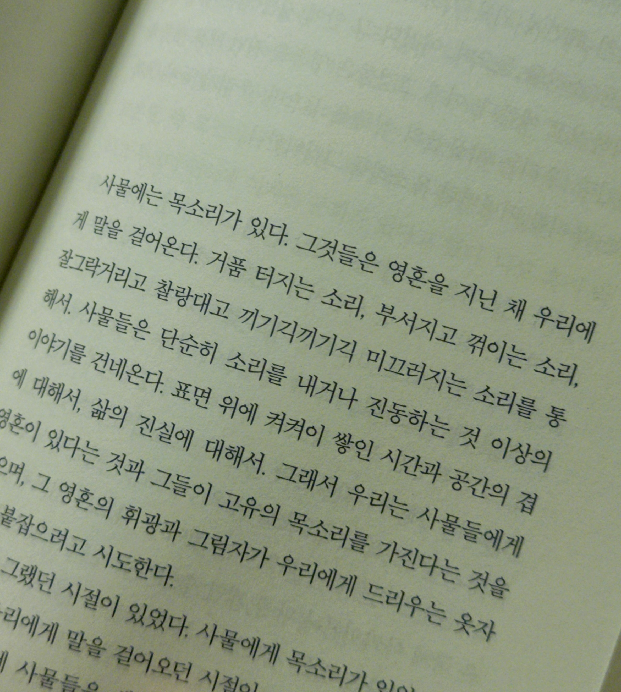

어릴 적은 정말 책을 많이 읽었다. 하루 종일, 가끔은 부모님이 책 좀 그만 보고 밖에 나가서 놀라고 하실 정도로. 하지만 작은 책 안에 존재하는 무한한 세계는 나에게 너무 매혹적이었다.

하지만 디지털 세계에 더 많은 콘텐츠를 접하고 나서는 느리게 전달되는 책이 주는 즐거움을 빠르게 잊어버렸다. 순식간에 바뀌는 세상에서 살아남으려면 천천히 스며드는 활자의 감동은 이제는 별 볼일 없게 되었고, 더 매력적인 즐길 거리들이 넘쳐난다고 생각했다.

"책을 읽는 게 무슨 의미가 있지? 가상의 세계에서 나온 허구의 말들을 현실에 옮겨 적는 것으로 어떤 도움이 되고 우리는 거기서 무엇을 얻을 수 있지? 쓸모없는 행위 아닌가?" 그렇게 되뇌는 나를 발견했을 때, 세월의 흐름이 빨라진 것도 아니고, 거친 활자가 전달하는 무언가가 사라진 것도 아니었다는 것을 알게 되었다. 다만, 독서의 쓸모를 찾고 있는 달라진 내가 있었을 뿐.

책을 읽다 보면 어떤 말들은 작가가 독자에게, 세상에 던지는 질문이자 선언처럼 다가온다.

> 쓸모를 증명하라고 말하는 세계에 저항하려고.

책은 이런 질문과 선언으로 가득하다. 그리고 그 질문과 선언은 나에게도 던져진다. 나는 이 책을 읽으면서, 그리고 책을 덮고 나서도, 그 질문과 선언에 대해 생각하게 된다. 

`양면의 조개껍데기` 는 7편의 단편이 담겨 있는데, 영혼을 지닌 채 우리에게 말을 걸어오는, 경계, 소통 그리고 인간성과 존재에 대한 이야기들이 담겨 있다. 특히 내 안의 또 다른 나, 한 몸에 공존하는 다수 그리고 그런 스스로를 바라보는 존재에 대한 이야기들이 주를 이루었다. 글에서는 존재를 그대로 긍정하면서 스스로 선택에 의한 변화를, 그것이 설령 자신의 존재 자체를 파괴하는 변화더라도, 그 선택과 과정, 삶의 모든 것을 응원해 주는 것을 느낄 수 있었다.

책을 읽는 내내 많은 장면들이 현실의 개념과 존재를 비추는 은유처럼 읽혔다. 소수자부터 인공지능 같은 새로운 존재들까지, 그리고 그 사이에 놓인 수많은 경계에 대한 이야기들이 담겨 있었다. 그 이야기들은 내게 인간이란 무엇인지, 존재란 무엇인지, 소통이란 무엇인지 묻는 질문을 던졌고, 그에 대한 작가의 사유를 엿볼 수 있게 해 주었다.